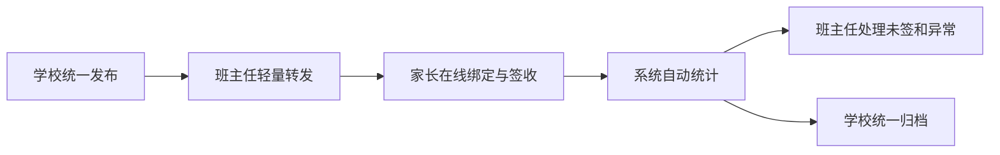
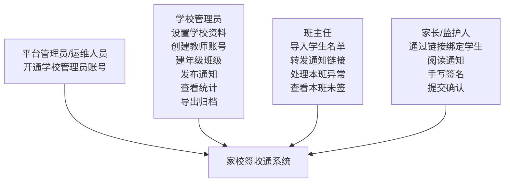
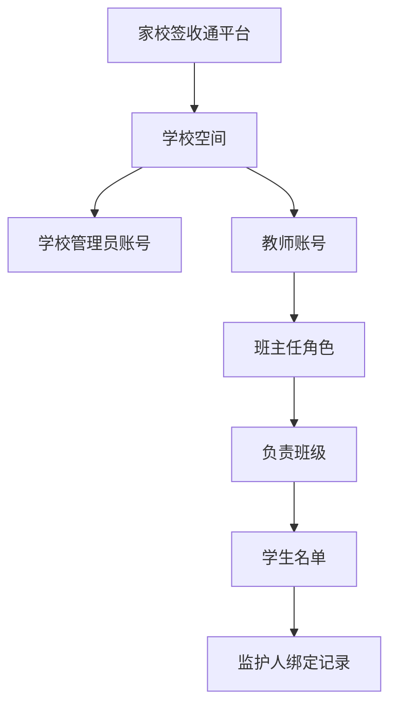
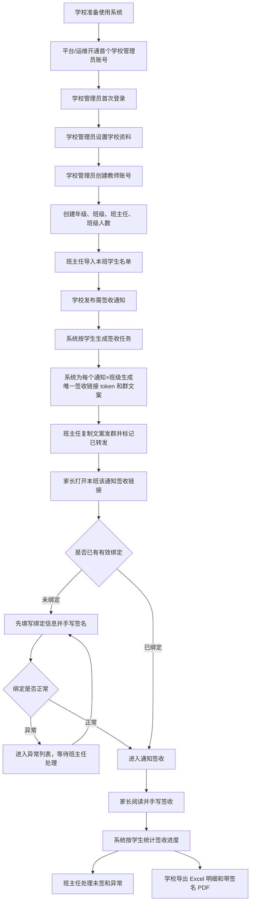
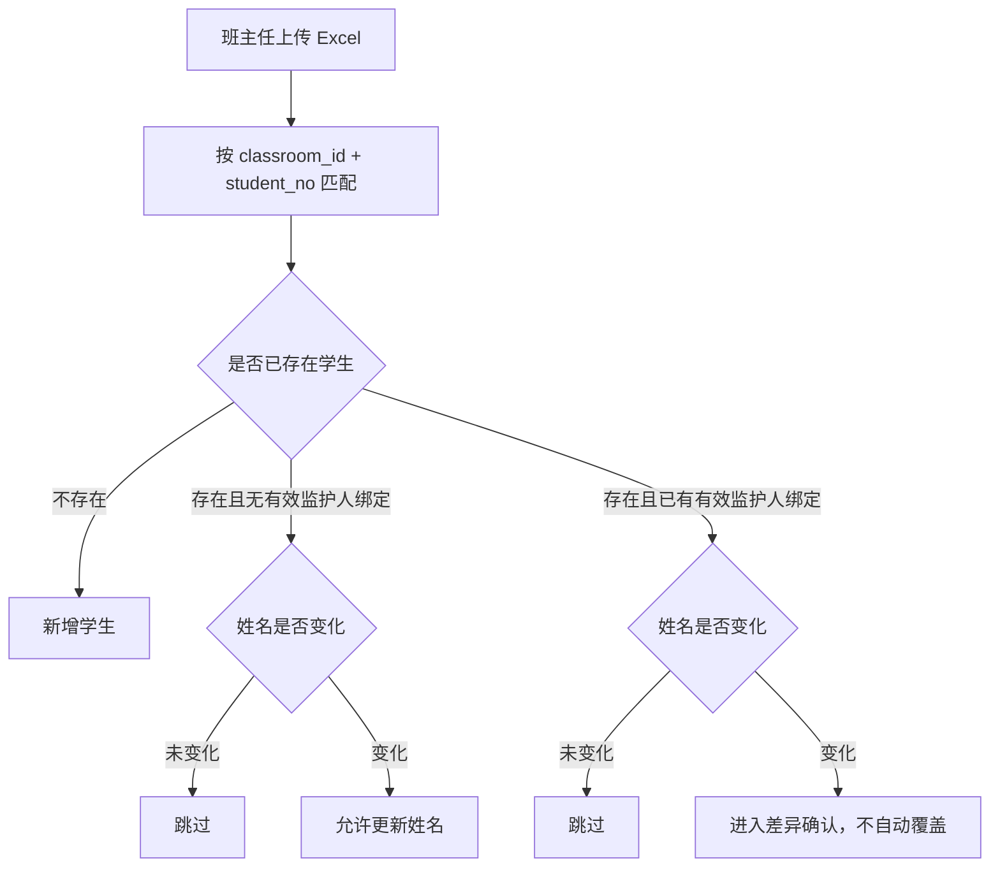
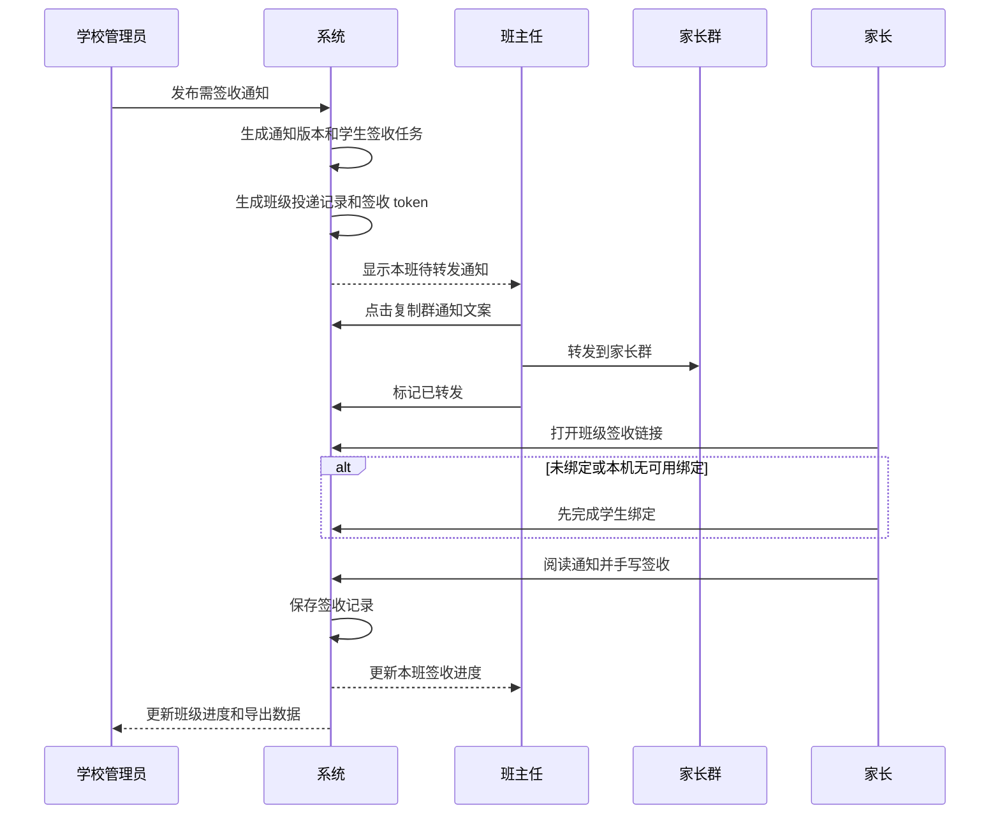
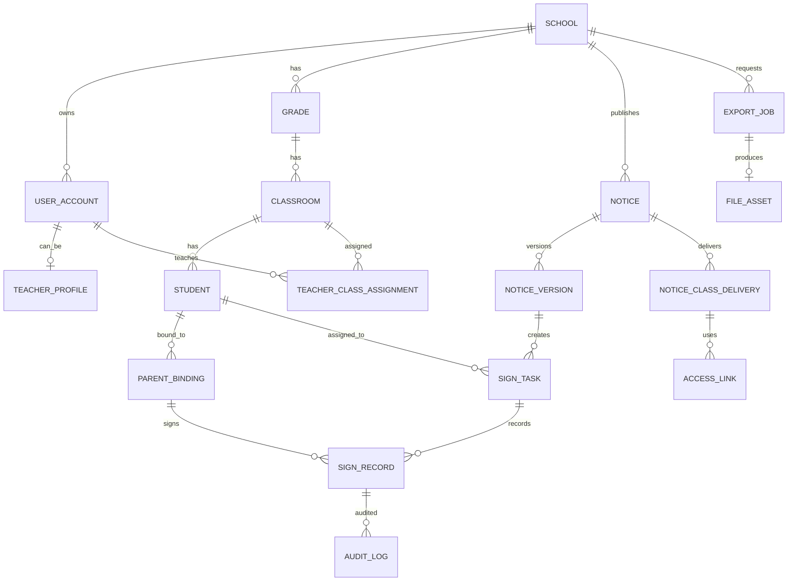
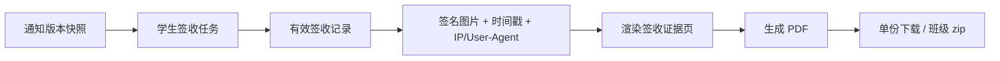

# 家校签收通产品需求设计文档

- **版本**：v0.7
- **日期**：2026-06-06
- **阶段**：MVP 正式开发需求规格
- **目标形态**：部署到服务器的网页 MVP
- **源文档说明**：Markdown 是需求与实施决策的源头。后续页面草图、前端、接口和后端实现中的新增决策，必须回写到本文档或实施约定文档。

## 0. v0.7 关键修订

本版本在 v0.6 的业务规则基础上，补齐页面级 PRD，并吸收旧界面稿中已经确认的三端流程：

1. 把“信息架构与核心页面”升级为“页面功能详述”，按通用/运维、学校管理员、班主任、家长端和归档证据分组描述。
2. 为每个页面补充页面功能、UI 布局和交互逻辑，方便开发、评审和验收逐页对齐。
3. 明确后台端高频工作台布局：左侧导航、顶部上下文、指标摘要、表格台账、筛选工具条和批量操作区。
4. 明确家长端手机优先布局：token 校验、班级提示、隐私告知、表单输入、手写签名和提交结果。
5. 明确所有全局状态页：空数据、无权限、链接失效、导入/导出失败、加载中、限流和弱网重试。
6. 保留 v0.6 已确认的核心口径：签收任务按学生生成，签收记录按监护人保存；任一有效监护人完成签收，该学生计为已签。
7. 继续强调真实数据必须使用域名 + HTTPS，HTTP/IP + 端口只允许假数据或内部流程测试。

## 1. 默认假设与边界

1. 产品采用“平台开通首个学校管理员账号，学校管理员自行完成学校设置”的组织模型，学校不开放自助注册。
2. MVP 必须提供最小运维管理后台，用于平台/运维人员创建最小学校空间、开通首个学校管理员账号和必要的账号重置；初始化脚本只能作为应急或部署辅助手段。
3. 平台/运维不负责填写或维护学校名称、学校资料、年级班级、教师账号等学校业务设置；这些设置全部由学校管理员登录后处理。
4. 教师账号必须绑定到学校下面；班主任账号由学校管理员创建和分配。
5. 学校目前只有班级总人数、班主任信息和老师微信群，没有统一家长手机号名单。
6. 各班学生名单 Excel 由班主任导入，MVP 模板只包含 `学生姓名` 和 `班内序号`。
7. 各班班主任有本班家长微信群，MVP 仍由班主任转发系统生成的班级专属通知。
8. 家长不创建后台账号，不提供家长个人中心；家长通过班级链接完成绑定与签收。
9. 家长绑定时，允许一名学生绑定多个监护人。
10. 家长绑定必须填写手机号；MVP 不做手机号验证码，手机号只作为弱身份辅助和必要联系信息，不作为法律级身份认证。
11. MVP 支持多种通知类型，但签收规则仍统一为“需要家长手写签名”；内置类型包括安全承诺书、家长告知书、活动回执、资料确认、防溺水告知和其他，学校管理员可填写自定义类型。
12. 需要签收的通知必须支持导出带家长签名的 PDF；支持单份生成和按班级批量下载。
13. 通知正文由学校自行填写；正文来源支持直接粘贴文字，或上传 PDF 原件并填写签收说明。上传 PDF 作为通知附件保存，不做原始 PDF 坐标签章。
14. 真实数据试点必须使用域名 + HTTPS。服务器 IP + HTTP 端口仅允许假数据流程测试、内部演示或开发联调。
15. 服务器、数据备份和管理员账号由用户维护，但系统需求必须写清最低安全与备份规则。
16. 学校管理员和班主任首次登录不强制修改初始密码；如学校内部要求，可手动修改密码。

## 2. 产品定位

`家校签收通` 不是简单的“在线签名工具”，而是学校级的家长通知签收中台。

它要跑通这条链路：



### 2.1 核心目标

- 降低学生代签风险。
- 减少班主任发文件、催签、收纸、统计、截图留档的重复劳动。
- 让学校通过班级进度表和导出总表看到签收进度，MVP 不做华丽的全校大盘看板。
- 形成可追溯的签收记录：通知版本、家长信息、手写签名、提交时间、IP 和设备信息。
- 保持低门槛：家长不需要注册账号、关注公众号或安装 App。

### 2.2 成功标准

| 指标 | 第一版目标 |
|---|---|
| 班主任首次操作 | 导入学生名单、转发通知签收链接、处理少量异常 |
| 后续每次通知 | 复制系统文案发到家长群，并标记已转发 |
| 签收统计 | 系统自动生成，不需要班主任手工汇总 |
| 未签名单 | 按班级自动筛选，区分未绑定、待签、逾期未签 |
| 签收记录 | 可按通知导出 Excel 明细、单份带签名 PDF、班级 PDF zip |
| 真实数据安全 | HTTPS、权限隔离、下载鉴权、备份和隐私告知可验收 |

## 3. 角色、账号与权限

### 3.1 角色定义



| 角色 | 负责什么 | 不应该负责什么 |
|---|---|---|
| 平台管理员/运维人员 | 开通最小学校空间和首个学校管理员账号，必要时重置学校管理员账号 | 设置学校名称、学校资料、年级班级、教师账号，或处理具体班级签收业务，除非用户授权排障 |
| 学校管理员 | 设置本校资料，管理本校组织、教师账号、通知发布、班级进度、归档导出 | 逐个收集家长签名 |
| 班主任 | 登录学校账号、导入本班学生名单、转发系统文案、处理本班异常、提醒未签家长 | 手写统计、逐个录入家长信息、查看其他班数据 |
| 家长 | 自助绑定、阅读通知、手写签字、提交确认 | 使用后台、查看班级名单、查看其他学生信息 |
| 系统 | 生成链接、校验权限、记录签收、统计进度、生成导出 | 替代学校做法律级 CA 电子认证 |

### 3.2 组织归属



| 账号/对象 | 创建方式 | 权限范围 |
|---|---|---|
| 学校空间 | 平台管理员/运维人员创建最小空间 | 只能管理本校数据 |
| 学校管理员 | 平台/运维开通首个账号；后续账号由学校管理员管理 | 设置学校资料，管理本校组织、教师账号、通知和归档 |
| 班主任账号 | 学校管理员创建 | 只管理被分配班级 |
| 家长访问者 | 通过通知班级 token 链接访问 | 只能访问 token 对应通知和班级的绑定或签收页面 |

### 3.3 权限矩阵

| 操作 | 平台管理员/运维 | 学校管理员 | 班主任 | 家长链接访问者 |
|---|---:|---:|---:|---:|
| 开通最小学校空间和首个学校管理员账号 | 是 | 否 | 否 | 否 |
| 重置首个学校管理员账号 | 是 | 否 | 否 | 否 |
| 设置学校名称和学校资料 | 否 | 是 | 否 | 否 |
| 创建教师账号 | 否 | 是 | 否 | 否 |
| 创建年级、班级 | 否 | 是 | 否 | 否 |
| 分配班主任到班级 | 否 | 是 | 否 | 否 |
| 导入学生名单 | 否 | 可代操作 | 仅本班 | 否 |
| 生成/撤销通知签收链接 | 否 | 本校 | 仅本班 | 否 |
| 发布通知 | 否 | 是 | 否 | 否 |
| 复制/标记班级转发 | 否 | 可查看 | 仅本班 | 否 |
| 处理绑定异常 | 否 | 本校 | 仅本班 | 否 |
| 处理签收异常 | 否 | 本校 | 仅本班 | 否 |
| 查看班级进度 | 否 | 本校全部 | 仅本班 | 否 |
| 导出 Excel/PDF/zip | 否 | 本校授权范围 | 仅本班 | 否 |
| 家长绑定和签收 | 否 | 否 | 否 | 仅 token 对应范围 |

所有后台接口必须做服务端权限校验；前端隐藏按钮不能替代权限控制。

## 4. 总体业务逻辑

系统分成两条主线：

1. **通知驱动绑定**：没有家长手机号和统一身份库时，不单独做冷启动绑定链接；家长第一次打开某份通知的班级专属签收链接时，若未绑定则先绑定再签收。
2. **通知签收任务**：学校统一发布，系统按学生生成签收任务，并为每个“通知 × 班级投递”生成唯一签收链接；班主任转发本班链接，家长在线签收，系统自动统计和归档。



## 5. 学生名单导入

### 5.1 导入字段

班主任通过 Excel 导入本班学生名单。MVP 模板只保留两个字段：`学生姓名`、`班内序号`，模板文件只提供表头，不内置示例学生行，避免示例数据被误导入。

| 字段 | 必填 | 说明 |
|---|---|---|
| 学生姓名 | 是 | 用于展示和辅助匹配 |
| 班内序号 | 是 | 班级内唯一键，用于避免重名冲突 |

不采用“学生姓名”作为唯一键。唯一键使用 `classroom_id + student_no`。

### 5.2 导入方式

| 方式 | MVP 要求 |
|---|---|
| Excel 上传 | 主路径，必须支持 |
| 粘贴名单 | 可选辅助，每行一个学生；如果实现成本高，可以后置 |
| 粘贴表格 | 可选辅助；如果实现成本高，可以后置 |

### 5.3 字段规范化

| 项目 | 规则 |
|---|---|
| 学生姓名 | 去除首尾空格；保留中文姓名原样；连续空格压缩为单个空格 |
| 班内序号 | 统一按字符串保存；去除首尾空格；`01` 和 `1` 视为不同值，避免误改学校习惯 |
| 空行 | 忽略 |
| 额外列 | 忽略，但导入预览中提示 |
| 缺少必填列 | 阻止导入 |

### 5.4 导入校验与阻断规则

| 校验项 | 处理规则 |
|---|---|
| 缺少 `学生姓名` 或 `班内序号` 列 | 阻止导入 |
| 学生姓名为空 | 阻止导入 |
| 班内序号为空 | 阻止导入 |
| 同一文件内班内序号重复 | 阻止导入 |
| 班内序号与本班已有学生重复 | 按更新规则处理，不直接阻止 |
| 存在重名学生 | 允许导入，只提示“存在重名，请依赖班内序号区分” |
| 导入人数不等于班级应有人数 | 警告；允许班主任确认后继续提交 |
| 文件格式不支持 | 阻止导入 |

### 5.5 导入预览与提交

导入必须分两步：

1. **预检/预览**：系统返回新增、更新、跳过、差异、错误和警告。
2. **确认提交**：班主任确认后，系统在一个事务内写入。

### 5.6 导入更新规则



| 场景 | 规则 |
|---|---|
| 新学生 | 新增学生，状态为有效 |
| 已存在且姓名不变 | 跳过 |
| 已存在、未绑定、姓名变化 | 允许更新姓名 |
| 已存在、已绑定、姓名变化 | 不自动覆盖；进入差异确认 |
| Excel 中缺少已有学生 | 默认不删除、不停用；在差异提示中列出，由班主任或学校管理员另行处理 |
| 班内序号变更 | 视为一个新学生；已绑定学生不得通过导入直接改序号 |

## 6. 家长链接与自助绑定

### 6.1 链接类型

MVP 只保留一种家长端业务链接：**通知班级签收链接**。不再单独生成“班级冷启动绑定链接”。家长首次打开通知签收链接时，如果系统无法识别有效监护人绑定，则先进入绑定流程，绑定成功后继续签收当前通知。

| 链接类型 | 用途 | 入口结果 |
|---|---|---|
| 通知班级签收链接 | 某份通知在某个班级的专属签收入口 | 已绑定家长进入签收；未绑定家长先绑定，绑定成功后继续进入该通知签收 |

链接唯一性规则：

- 同一份通知发到不同班级，生成不同链接。
- 同一个班级收到不同通知，生成不同链接。
- 链接绑定到 `notice_id + notice_version_id + classroom_id + class_delivery_id`，不能跨通知、跨版本、跨班级复用。
- MVP 默认一个班级一条该通知链接，由负责班主任复制转发；如果一个班有多名班主任，仍共用该班该通知链接，系统另行记录复制/标记转发的操作者。
- 若学校需要精确追踪“哪个老师转发带来的访问”，可在后续版本扩展为同一班级下多渠道链接；MVP 不做。

### 6.2 链接 token 安全规则

家长链接不能只靠 `schoolId`、`classId`、`noticeId`、`studentId` 等明文参数授权。

| 规则 | MVP 要求 |
|---|---|
| token 生成 | 服务端生成高强度随机 token，建议不少于 128 bit 熵 |
| token 存储 | 数据库存 token hash，不存明文 token |
| token 作用域 | 绑定 `school_id`、`classroom_id`、`notice_id`、`notice_version_id`、`class_delivery_id`，用途固定为 `SIGN` |
| token 生命周期 | 可设置过期时间；签收链接默认有效期至当前通知截止时间，截止后失效；若学校调整截止时间，未撤销的签收 token 同步更新过期时间 |
| token 撤销 | 学校管理员和班主任可在权限范围内撤销并重新生成链接 |
| token 访问 | 只允许进入该通知对应班级的绑定前置或签收页面，不允许访问后台 API |
| 服务端校验 | 每次提交都校验 token 对应学校、班级、通知、学生归属 |
| 防枚举 | 家长绑定匹配接口必须限流，失败次数过多时短暂拦截 |

### 6.3 家长绑定表单

| 字段 | 必填 | 说明 |
|---|---|---|
| 班级 | 是 | 由 token 自动带入，不允许家长自行改班级 |
| 学生姓名 | 是 | 家长输入；MVP 不展示全班名单 |
| 家长姓名 | 是 | 作为签收记录主体 |
| 与学生关系 | 是 | 父亲、母亲、祖父母、其他监护人 |
| 家长手机号 | 是 | 仅作为弱身份辅助和必要联系信息，不做验证码登录 |
| 手写签名 | 是 | 作为绑定确认痕迹 |
| 隐私告知确认 | 是 | 家长确认知悉信息收集用途 |

### 6.4 学生匹配规则

| 场景 | 系统处理 |
|---|---|
| 学生姓名在本班唯一匹配 | 允许进入绑定 |
| 学生姓名不存在 | 进入绑定异常，等待班主任确认 |
| 本班存在同名学生 | 进入绑定异常，等待班主任核对，不由系统猜测 |
| 家长尝试查看名单 | 不提供全班名单展示，避免学生信息泄露 |

### 6.5 多监护人与重复绑定

MVP 明确采用弱判重，不宣称能可靠识别真实同一监护人。

| 场景 | 规则 |
|---|---|
| 同一学生绑定父亲和母亲 | 正常，形成两条有效绑定 |
| 同一学生绑定多个不同关系监护人 | 正常 |
| 同一学生下 `家长姓名 + 关系` 完全相同 | 判为疑似重复，进入异常列表；不自动覆盖原绑定 |
| 同一学生下手机号相同但姓名或关系不同 | 判为信息冲突，进入异常列表 |
| 不同学生出现同名同关系家长 | 不判重复 |
| 家长换手机重新绑定同一学生 | 如果姓名 + 关系相同，进入疑似重复；班主任可确认是否保留 |

### 6.6 监护人绑定状态

绑定状态属于 `PARENT_BINDING`，不直接作为学生单一状态。

| 状态 | 含义 | 进入条件 | 可处理角色 |
|---|---|---|---|
| `VALID` | 有效绑定 | 自动匹配成功，且非疑似重复 | 无需处理 |
| `PENDING_REVIEW` | 待审核 | 匹配冲突、疑似重复、信息明显异常 | 班主任、学校管理员 |
| `REJECTED` | 已驳回 | 班主任确认无效 | 班主任、学校管理员 |
| `REVOKED` | 已撤销 | 后续发现冒名、争议、误绑 | 班主任、学校管理员 |

学生绑定进度由绑定记录聚合得出：

| 学生聚合状态 | 计算规则 |
|---|---|
| 未绑定 | 有效绑定数 = 0，待审核绑定数 = 0 |
| 已绑定 | 有效绑定数 >= 1，待审核绑定数 = 0 |
| 有异常待处理 | 待审核绑定数 >= 1 |
| 已绑定且有异常 | 有效绑定数 >= 1，同时待审核绑定数 >= 1 |

### 6.7 LocalStorage 缓存

`LocalStorage` 只用于降低同一台设备的重复填写成本，不作为签收证据来源。

| 规则 | MVP 要求 |
|---|---|
| 缓存内容 | 家长姓名、关系、手机号、最近绑定的 `binding_id` 摘要 |
| 缓存键 | 按 `school_id + classroom_id + binding_id + guardian_name + relation` 分组 |
| 多孩子 | 允许缓存多条 |
| 换手机/清缓存 | 重新走绑定流程 |
| 证据来源 | 服务器保存的签收记录、签名图片、时间戳、IP、User-Agent 和 PDF |

## 7. 通知发布与签收任务

### 7.1 学校发布通知

学校管理员创建一份通知：

| 字段 | 必填 | 说明 |
|---|---|---|
| 通知标题 | 是 | 如“2026 年暑假安全承诺书” |
| 通知类型 | 是 | 内置类型包括安全承诺书、家长告知书、活动回执、资料确认、防溺水告知和其他；允许学校管理员自定义类型 |
| 正文来源 | 是 | `TEXT` 表示粘贴文字正文；`PDF` 表示上传 PDF 原件并填写签收说明 |
| 通知正文/签收说明 | 是 | 纯文本 + 简单格式；禁止原始脚本。PDF 通知仍需填写签收说明，便于家长端和归档摘要展示 |
| PDF 附件 | PDF 来源时必填 | 仅允许 PDF 文件；通过后端鉴权接口下载或预览，不允许静态路径直连 |
| 发布范围 | 是 | 全校、年级、班级 |
| 截止时间 | 是 | 使用北京时间，精确到分钟 |
| 是否需要手写签名 | 是 | MVP 固定为是 |
| 是否允许多个家长签 | 是 | MVP 固定允许，但只要求至少一位有效监护人签收 |
| 归档导出格式 | 是 | 导出 Excel、单份 PDF、班级 zip |

### 7.2 通知正文与版本规则

| 场景 | 规则 |
|---|---|
| 创建草稿 | 可编辑标题、通知类型、正文来源、正文或签收说明、范围、截止时间 |
| 发布通知 | 生成 `notice_version`，冻结标题、通知类型、正文或签收说明、PDF 附件摘要、发布范围 |
| 发布后改正文 | 不允许直接改已发布版本；必须创建新版本或重新发布 |
| 发布后改截止时间 | 允许学校管理员修改，但必须记录审计日志 |
| 已签后生成 PDF | 永远使用签收时对应的通知版本内容 |
| PDF 原件 | 作为通知附件保存并在后台记录文件名、大小、SHA-256；签收证据 PDF 只展示通知原件文件名和签收说明，不在原始 PDF 上打坐标签章 |
| 富文本安全 | 服务端保存或渲染前必须 sanitize；禁止 `script`、`iframe`、事件属性和外部脚本 |

### 7.3 发布范围展开

| 场景 | 规则 |
|---|---|
| 发布到全校 | 展开为本校全部有效班级 |
| 发布到年级 | 展开为年级下全部有效班级 |
| 发布到班级 | 展开为选中的班级 |
| 班级未导入学生 | 创建班级投递记录，但签收任务数为 0；进度提示“未导入学生” |
| 发布时已有学生 | 每个学生生成一条 `sign_task` |
| 发布后新增学生 | 如果属于通知覆盖范围，系统自动补建该通知的 `sign_task` |
| 学生转班 | MVP 不自动迁移历史任务；历史任务保留原班级归档 |

### 7.4 通知下发与班主任转发



班主任群通知文案：

```text
各位家长好，学校发布了《2026 年暑假安全承诺书》，请在 2026-06-10 18:00 前完成阅读和签字确认。

本班签收链接：
{班级专属签收链接}

请使用手机浏览器打开链接。

请家长本人完成签收，不要让学生代签。填写学生姓名、家长姓名、关系和手机号后完成绑定。本链接仅用于本班，请勿转发到其他班级。
```

### 7.5 签收任务与签收记录口径

MVP 固定口径：

- `SIGN_TASK` 按学生生成：一名学生对一份通知只有一条签收任务。
- `SIGN_RECORD` 按监护人保存：同一学生可有多个有效监护人签收记录。
- 统计按学生去重：任一有效监护人签收后，该学生计为已签。
- 同一监护人对同一任务只能有一条有效签收记录。
- 重复提交不覆盖原记录；系统提示已提交，必要时进入签收异常。

### 7.6 签收状态

为便于开发，区分“存储状态”和“展示状态”。

`sign_task.status` 存储状态：

| 状态 | 含义 |
|---|---|
| `PENDING` | 待签收 |
| `SIGNED` | 已有至少一条有效签收记录 |
| `EXCEPTION` | 签收记录存在争议或被标记异常 |
| `VOIDED` | 任务作废，MVP 一般不用 |

页面展示状态：

| 展示状态 | 计算规则 |
|---|---|
| 无法通知 | 学生没有有效监护人绑定 |
| 待签收 | 有有效监护人，任务 `PENDING`，未超过截止时间 |
| 逾期未签 | 有有效监护人，任务 `PENDING`，已超过截止时间 |
| 已签收 | 任务 `SIGNED`，首个有效签收时间 <= 截止时间 |
| 逾期已签 | 任务 `SIGNED`，首个有效签收时间 > 截止时间 |
| 签收异常 | 任务 `EXCEPTION` 或存在待处理签收异常 |

逾期后允许补签。补签后学生计为已签，但 Excel 和页面必须标记“逾期已签”。

### 7.7 重复签收与纠错

| 场景 | 规则 |
|---|---|
| 同一监护人重复打开已签通知 | 显示已提交结果；不覆盖签名 |
| 同一监护人重复提交 | 默认拦截并返回已有记录；如信息冲突则进入签收异常 |
| 另一有效监护人补充签收 | 允许新增签收记录；学生已签人数不重复增加 |
| 家长签错学生 | 班主任或学校管理员将记录标记为异常，旧记录保留，家长重新提交 |
| 学生代签被发现 | 标记为签收异常；处理后可要求重新签收 |
| 管理员确认异常记录有效 | 恢复为有效记录，统计重新计算 |

## 8. 异常处理规则

### 8.1 绑定异常

| 异常类型 | 触发条件 | 可处理角色 | 可操作项 | 处理后状态 |
|---|---|---|---|---|
| 学生姓名不存在 | 家长填写的学生姓名无法匹配本班 | 班主任、学校管理员 | 驳回、提醒家长重填 | `REJECTED` |
| 同名学生需要核对 | 本班存在同名学生，系统不能自动确定绑定对象 | 班主任、学校管理员 | 确认绑定到对应学生、驳回 | `VALID` 或 `REJECTED` |
| 疑似重复绑定 | 同一学生下家长姓名 + 关系重复 | 班主任、学校管理员 | 保留新绑定、驳回新绑定、撤销旧绑定 | `VALID`、`REJECTED` 或 `REVOKED` |
| 信息冲突 | 手机号相同但姓名/关系冲突 | 班主任、学校管理员 | 人工确认、驳回 | `VALID` 或 `REJECTED` |
| 冒名/争议 | 班主任或学校发现异常 | 班主任、学校管理员 | 撤销绑定、保留说明 | `REVOKED` |

所有异常处理必须记录处理人、处理时间、处理动作和备注。

### 8.2 签收异常

| 异常类型 | 触发条件 | 可处理角色 | 可操作项 | 是否影响已签统计 |
|---|---|---|---|---|
| 重复提交冲突 | 同一监护人重复提交且信息不一致 | 班主任、学校管理员 | 标记异常、确认有效、作废新记录 | 视最终有效记录而定 |
| 签错学生 | 家长或班主任反馈 | 班主任、学校管理员 | 标记异常、要求重签 | 是 |
| 疑似学生代签 | 班主任发现或家长申诉 | 班主任、学校管理员 | 标记异常、要求重签 | 是 |
| 签名为空或不可辨认 | 系统校验或人工发现 | 班主任、学校管理员 | 标记异常、要求重签 | 是 |

## 9. 统计口径

### 9.1 班级进度字段

| 字段 | 计算公式 |
|---|---|
| 应签人数 | 通知发布范围内该班签收任务数、已导入有效学生数和班级预计人数三者取最大值；未导入学生前按学校设置里的班级预计人数展示 |
| 已签人数 | 至少一名有效监护人完成该通知有效签收的学生数 |
| 按时已签 | 首个有效签收时间 <= 截止时间的学生数 |
| 逾期已签 | 首个有效签收时间 > 截止时间的学生数 |
| 待签人数 | 有有效监护人、未签、未超过截止时间的学生数 |
| 逾期未签 | 有有效监护人、未签、已超过截止时间的学生数 |
| 未绑定人数 | 无有效监护人绑定的学生数 |
| 异常人数 | 存在待处理绑定异常或签收异常的学生数 |
| 签收率 | 已签人数 / 应签人数 |

未绑定学生不计入“待签人数”，但计入应签人数和未绑定人数。

### 9.2 未签名单

班主任端未签名单至少支持筛选：

- 未绑定。
- 待签。
- 逾期未签。
- 签收异常。

未签提醒 MVP 只做“复制提醒话术”和“手动标记已提醒”。提醒记录保存提醒人、提醒时间和备注，不做短信或微信自动发送。

## 10. 页面功能详述

### 10.1 页面范围与导航结构

页面需求以本 Markdown 为源头，正式前端工程位于 `web/`。正式 MVP 中，平台/运维只负责开通首个学校管理员账号；学校管理员负责学校资料、组织、账号、通知发布、统计和归档；班主任负责本班学生、链接、转发、未签和异常；家长不进入后台，只通过 token 链接完成绑定与签收。

```mermaid
flowchart TB
  APP["家校签收通"]
  APP --> COMMON["通用与运维"]
  APP --> SCHOOL["学校管理员端"]
  APP --> TEACHER["班主任端"]
  APP --> PARENT["家长端"]
  APP --> ARCHIVE["归档证据"]

  COMMON --> C1["学校管理员账号开通"]
  COMMON --> C2["登录与会话"]
  COMMON --> C3["全局状态页"]

  SCHOOL --> S1["学校首页与班级进度表"]
  SCHOOL --> S2["学校资料设置"]
  SCHOOL --> S3["年级班级管理"]
  SCHOOL --> S4["教师账号管理"]
  SCHOOL --> S5["通知草稿列表"]
  SCHOOL --> S6["通知编辑/预览/发布"]
  SCHOOL --> S7["通知详情与班级投递"]
  SCHOOL --> S8["导出中心"]
  SCHOOL --> S9["审计与安全检查"]

  TEACHER --> T1["班主任首页"]
  TEACHER --> T2["学生名单导入向导"]
  TEACHER --> T4["本班通知列表"]
  TEACHER --> T5["单个通知工作台"]
  T5 --> T51["签收链接管理"]
  T5 --> T52["通知转发"]
  T5 --> T53["签收进度"]
  T5 --> T54["异常处理"]
  T5 --> T55["本班导出"]

  PARENT --> P0["家长链接解析页"]
  PARENT --> P1["家长绑定页"]
  PARENT --> P2["绑定结果页"]
  PARENT --> P3["家长签收页"]
  PARENT --> P4["签收结果页"]

  ARCHIVE --> A1["PDF 签收证据页版式"]
```



页面边界说明：

1. 后台端统一采用“左侧导航 + 顶部上下文 + 主内容台账”的工作台结构。
2. 家长端统一采用手机优先结构，不展示全班名单，不提供家长登录、个人中心或历史记录列表。
3. 通知创建、预览和发布的正式权限属于学校管理员；班主任端只展示本班待转发通知和群文案复制入口。
4. 所有家长链接都先进入 token 解析逻辑；页面可以合并实现，但需求上必须覆盖解析、有效、无效、过期、撤销、限流和范围不匹配状态。
5. React 前端实现不得单独承载产品决策；本节 Markdown 是页面需求源头。

### 10.2 通用与运维页面

#### 10.2.1 学校管理员账号开通

**页面功能**

平台管理员或运维人员只负责为学校开通首个学校管理员账号，并创建系统所需的最小学校空间占位。学校名称、学校简称、学校联系人、组织架构和教师账号等设置不在该页面处理，全部由学校管理员登录后维护。MVP 必须提供最小运维管理后台页面；初始化脚本只能作为应急或部署辅助手段，不作为正式试点主路径。

**UI 布局**

- **顶部说明区**：显示当前操作为“运维管理后台 / 学校管理员账号开通”，提示平台/运维不维护学校业务设置。
- **账号开通区**：填写学校管理员姓名、登录名，生成或录入初始密码；初始密码只一次性展示。
- **最小空间占位区**：系统生成 `school_id` 和默认占位名称，仅用于数据隔离和账号归属。
- **安全提示区**：提示真实数据试点必须使用 HTTPS、文件鉴权和备份；具体学校资料由学校管理员后台补齐。
- **结果反馈区**：展示学校空间编号、管理员账号、初始化时间、操作人和下一步登录入口。

**交互逻辑**

- **开通管理员账号**：提交后生成最小 `school_id`，创建学校管理员账号，写入审计日志。
- **生成初始密码**：页面只展示一次明文初始密码；服务端只保存密码 hash。
- **重置学校管理员**：运维可在授权排障场景重置管理员密码，必须记录操作人和原因。
- **学校资料设置**：平台/运维页面不提供学校名称、学校简称、联系人、年级班级和教师账号配置入口。
- **账号开通完成**：学校管理员首次登录后进入学校资料设置或首页待办，继续完成本校资料、组织和教师账号配置。
- **停用/恢复学校空间**：平台运维可停用或恢复学校空间；停用后该校后台用户不可登录，历史归档不得被直接删除。

#### 10.2.2 登录与会话

**页面功能**

学校管理员和班主任共用后台登录入口。登录成功后系统按角色进入对应工作台；平台运维使用 `/ops` 独立登录入口，未登录时只显示运维登录表单，不展示学校空间、开户、重置或检查清单等工作台内容；家长端不使用后台登录页。

**UI 布局**

- **左侧角色说明区**：简要说明学校管理员、班主任、家长端的入口差异。
- **登录表单区**：包含用户名、密码、登录按钮、登录错误提示。
- **运维登录区**：`/ops` 入口只接受平台运维账号登录，登录成功后才渲染运维工作台；未登录或会话过期时不展示运维功能区。
- **会话操作区**：提供退出登录、清除本地会话、可选修改密码入口。
- **修改密码区**：登录后按需展开，包含原密码、新密码、确认新密码。
- **底部安全提示区**：提示初始密码可直接登录，但学校可按内部要求手动修改。

**交互逻辑**

- **登录提交**：校验用户名和密码，成功后返回 token/session，并根据角色跳转学校端或班主任端。
- **运维登录提交**：校验平台运维账号和密码，成功后进入 `/ops` 运维工作台；失败、过期或退出后回到运维登录表单。
- **登录失败**：展示失败原因；连续失败触发限流或临时锁定。
- **账号禁用**：提示账号已禁用，要求联系学校管理员。
- **会话过期**：保存当前访问目标，跳转登录页，登录后回到原页面。
- **可选修改密码**：不强制首次登录改密；用户主动修改时校验原密码、新密码长度和确认密码一致。

#### 10.2.3 全局状态页与边界反馈

**页面功能**

统一承载空数据、加载中、失败、无权限、链接失效、限流、导入失败、导出失败等边界反馈，避免不同页面出现不一致提示。

**UI 布局**

- **状态标题区**：用明确标题说明当前状态，例如“链接已过期”“暂无学生名单”“无权限访问该班级”。
- **原因说明区**：显示系统判断原因，避免只给错误码。
- **可恢复操作区**：根据状态提供返回、重试、联系班主任、重新登录、刷新任务等按钮。
- **技术信息区**：可折叠展示错误码、请求编号、时间，便于排障。
- **权限提示区**：跨班、跨校、跨通知访问时只说明无权限，不泄露目标资源详情。

**交互逻辑**

- **空状态**：引导进入下一步，例如导入学生、创建通知、生成链接。
- **无权限**：服务端返回 `FORBIDDEN` 时展示拒绝访问，不在前端继续请求详情。
- **token 异常**：`TOKEN_INVALID`、`TOKEN_EXPIRED`、`TOKEN_REVOKED` 分别展示对应解释和联系班主任提示。
- **失败可重试**：导入、导出、网络错误提供重试按钮；重复点击需防抖。
- **限流状态**：展示稍后再试，不展示可被枚举利用的具体匹配信息。

### 10.3 学校管理员端页面

#### 10.3.1 学校首页与班级进度表

**页面功能**

学校管理员查看当前通知在各班的转发和签收进度，快速识别未转发、签收不足、异常待处理和需要导出的班级。

**UI 布局**

- **顶部上下文区**：显示学校名称、当前通知筛选、截止时间、更新时间。
- **指标摘要区**：展示覆盖班级数、应签学生数、已签学生数、未绑定数、异常数和整体签收率。
- **筛选工具区**：按通知、年级、班级、转发状态、签收状态、异常状态筛选。
- **班级进度表区**：表格列包含通知、班级、应签、已签、未绑定、异常、签收率、截止时间、转发状态、操作。
- **右侧/底部待办区**：展示未转发班级、异常待处理、即将截止通知和导出入口。

**交互逻辑**

- **切换通知**：刷新班级进度表和指标摘要，统计按学生去重。
- **空进度**：后端成功返回空结果时，显示“暂无班级进度”并引导创建通知或导入学生，不展示演示样例数据。
- **查看明细**：进入通知详情或班级签收明细，学校管理员可查看本校全部班级。
- **催转发**：对未标记转发班级显示“提醒班主任”或复制沟通话术，不自动发送微信。
- **异常跳转**：点击异常数进入异常处理中心并带入班级/通知筛选条件。
- **导出跳转**：从班级行进入导出中心，自动带入通知和班级范围。

#### 10.3.2 学校资料设置

**页面功能**

学校管理员维护本校基础资料和试点配置。该页面承接平台/运维开通账号后的首个配置任务，学校名称、学校简称、联系人、隐私联系人、数据保留口径等都由学校管理员自行设置。

**UI 布局**

- **基础资料区**：填写学校名称、学校简称、所在地区、校内联系人、联系电话。
- **展示信息区**：设置后台顶部显示名称、家长端页面显示名称、PDF 归档页学校名称。
- **隐私与归档区**：填写隐私告知联系人、数据保留周期、试点结束后的数据处理说明。
- **安全状态区**：只读展示 HTTPS、文件鉴权、备份状态等部署检查结果。
- **保存记录区**：展示最近修改人、修改时间和审计记录入口。

**交互逻辑**

- **首次登录引导**：学校管理员首次登录后，如学校资料未完善，首页提示先完成学校资料设置。
- **保存学校资料**：校验学校名称必填，保存后同步影响后台顶部、家长端链接页和 PDF 证据页展示。
- **修改学校名称**：允许学校管理员修改，但必须记录审计日志；历史 PDF 使用生成时的学校名称快照。
- **隐私联系人变更**：变更后新提交的绑定/签收记录保存新的隐私告知版本。
- **安全状态查看**：安全状态只用于提示，不允许学校管理员在此修改服务器、证书、备份等运维配置。

#### 10.3.3 年级班级管理

**页面功能**

学校管理员创建和维护年级、班级、应有人数，并把班主任账号分配到班级。

**UI 布局**

- **年级树/列表区**：展示年级及下属班级，支持按状态筛选。
- **班级表格区**：展示班级名称、应有人数、班主任、导入状态、绑定进度、启用状态。
- **编辑表单区**：新增或编辑年级、班级名称、应有人数、班主任。
- **导入状态区**：显示是否已导入学生、最近导入时间、人数差异提示。
- **历史归档提示区**：停用班级时提示历史任务和归档保留规则。

**交互逻辑**

- **新增年级/班级**：校验同校内名称重复，保存后立即出现在组织树；新增年级时可填写初始班级数，系统按“（1）班、（2）班”自动生成初始班级并写入默认预计人数。
- **编辑年级**：允许修改年级名称和入学年份；年级名称变更时，同步更新该年级下已有班级的年级字段，避免班级从年级列表中脱离；编辑年级弹窗内可直接调整该年级下班级所属年级、班级名称和预计人数，也可继续新增该年级班级。
- **删除年级**：点击删除时必须二次确认；确认后删除该年级及其下属班级，并清理相关学生、签收任务、访问链接、异常、导出任务等关联数据。
- **设置应有人数**：作为学生导入人数不一致警告依据，不直接阻断导入。
- **分配班主任**：一个班级至少可分配一名班主任；班主任只获得被分配班级权限。
- **停用班级**：停用后不再进入新通知发布范围，历史签收和导出仍可查询。
- **删除限制**：单独删除班级时，已有学生、绑定、签收任务或归档记录的班级不得硬删除。

#### 10.3.4 教师账号管理

**页面功能**

学校管理员创建班主任账号、重置密码、禁用账号，并维护教师与班级的负责关系。

**UI 布局**

- **账号列表区**：展示教师姓名、用户名、角色、负责班级、启用状态、最近登录时间。
- **账号创建区**：输入姓名、用户名、角色、负责班级，生成或设置初始密码。
- **账号批量导入区**：教师账号 CSV 模板包含可选“初始密码”列；未填写时系统逐行生成初始密码。
- **密码重置弹窗**：确认重置原因，展示一次性新密码。
- **账号状态区**：区分启用、禁用、待分配班级。
- **批量操作区**：除账号批量导入外，列表批量操作 MVP 可不做；若做，只支持批量禁用或导出账号清单。

**交互逻辑**

- **创建账号**：用户名校验唯一，密码只保存 hash，手动新增或批量导入产生的初始密码只在本次操作结果中一次性告知。
- **批量自定义初始密码**：学校管理员批量导入教师账号时，可按行填写 8 到 128 位初始密码；空白行由系统生成。导入遇到已存在账号时，不通过导入修改密码，应使用重置密码功能。
- **分配班级**：更新教师权限范围，服务端接口必须同步校验。
- **重置密码**：支持随机生成新密码或由学校管理员自定义新密码，并写审计日志；旧密码立即失效，新密码只在本次操作结果中展示一次。
- **禁用账号**：禁用后清理/失效会话，用户不能继续访问后台。
- **查看敏感信息**：页面不得展示明文历史密码、密钥或 token。

#### 10.3.5 通知草稿列表

**页面功能**

学校管理员统一管理通知草稿、已发布通知、已截止通知和已归档通知。

**UI 布局**

- **顶部操作区**：提供新建通知、搜索、状态筛选、范围筛选。
- **通知列表区**：展示标题、发布范围、状态、版本号、截止时间、发布时间、签收率。
- **状态标签区**：区分草稿、已发布、已截止、已归档。
- **快捷操作区**：草稿可继续编辑；已发布可查看进度；已截止可进入导出。
- **空状态区**：无通知时引导新建通知。

**交互逻辑**

- **新建通知**：进入通知编辑页，默认状态为草稿。
- **继续编辑草稿**：允许修改标题、正文、范围、截止时间。
- **查看已发布通知**：进入通知详情与班级投递页。
- **发布后改正文**：列表层不提供直接编辑正文入口，提示创建新版本或重新发布。
- **修改截止时间**：从详情页操作，必须记录审计日志。

#### 10.3.6 通知编辑、预览与发布

**页面功能**

学校管理员创建通知，选择通知类型、正文来源、发布范围和截止时间，并在发布前确认家长端预览和任务生成数量。

**UI 布局**

- **基础信息区**：填写通知标题、通知类型、截止时间、签名要求、可选备注；通知类型支持内置选项和自定义输入。
- **正文编辑区**：支持粘贴文字正文，或选择 PDF 来源后上传 PDF 原件并填写签收说明；不允许脚本、iframe、事件属性和外部脚本。
- **发布范围区**：按全校、年级、班级选择，并显示范围展开结果。
- **预览区**：展示家长签收页预览，包括标题、类型、正文或签收说明、PDF 附件入口、确认声明和签名位置。
- **发布确认区**：显示将生成的班级投递数、学生签收任务数、未导入班级提示。

**交互逻辑**

- **保存草稿**：保存但不生成签收任务，不通知班主任。
- **预览通知**：使用当前草稿内容渲染预览，不冻结版本。
- **选择范围**：动态计算覆盖班级和学生数量；班级未导入学生时提示任务数为 0。
- **发布通知**：生成通知版本、冻结标题正文范围，按学生生成签收任务，生成班级投递记录。
- **发布阻断**：标题、通知类型、正文或签收说明、范围、截止时间缺失时阻断；PDF 来源未上传附件时阻断；正文包含不安全内容时要求清理后再发布。

#### 10.3.7 通知详情与班级投递

**页面功能**

学校管理员查看已发布通知的版本、发布时间、截止时间、班级投递、转发状态、签收进度和后续导出入口。

**UI 布局**

- **通知摘要区**：显示标题、通知类型、正文来源、版本号、发布时间、截止时间、发布范围和发布人。
- **版本快照区**：只读展示已冻结正文或签收说明；PDF 来源额外展示附件文件名、大小和 SHA-256 摘要。
- **班级投递表区**：列出班级、班主任、转发状态、转发时间、应签、已签、未绑定、异常、签收率。
- **操作工具区**：修改截止时间、进入未签名单、进入异常中心、创建导出任务。
- **审计提示区**：展示截止时间修改、重新生成链接、导出等关键操作留痕。

**交互逻辑**

- **查看班级投递**：按班级展开进度，未导入学生显示“未导入学生”而不是 0% 误导。
- **修改截止时间**：允许学校管理员修改，要求填写原因并记录审计日志。
- **查看未签**：跳转到班级明细或班主任进度视图，带入通知和班级筛选。
- **提醒班主任**：复制提醒话术或标记已提醒，不自动向老师群发送。
- **进入导出**：带入当前通知范围，进入导出中心创建 Excel/PDF/zip 任务。

#### 10.3.8 导出中心

**页面功能**

集中创建、查看和下载 Excel 明细、单份 PDF、班级 PDF zip 等导出任务。所有批量导出均按异步任务处理。

**UI 布局**

- **导出条件区**：选择通知、年级、班级、导出格式、是否包含异常说明。
- **任务创建区**：展示预计文件类型、范围、过期时间和权限说明。
- **导出任务表区**：展示任务编号、类型、范围、状态、创建人、创建时间、完成时间、失败原因、下载入口。
- **失败处理区**：失败任务展示原因和重试按钮。
- **下载安全提示区**：说明文件必须通过鉴权接口下载，zip 默认 7 天过期。

**交互逻辑**

- **创建导出任务**：生成 `PENDING` 任务并进入后台处理，页面可轮询或手动刷新状态。
- **下载文件**：只有 `SUCCEEDED` 状态可下载，下载接口校验学校/班级权限。
- **任务失败**：展示失败原因，允许重试；重试生成新任务或复用任务编号须有明确记录。
- **重复点击导出**：不能造成页面阻塞；可复用最近成功文件或创建新任务。
- **无权限访问文件**：直接返回拒绝，不暴露真实文件路径。

#### 10.3.9 审计与安全检查

**页面功能**

学校管理员查看关键操作审计日志，并在真实班级试点前核对安全与备份检查项。

**UI 布局**

- **审计筛选区**：按操作类型、操作者、时间、班级、通知筛选。
- **审计日志表区**：展示时间、操作者、动作、对象、结果、IP/User-Agent 摘要。
- **安全检查清单区**：展示 HTTPS、反代、Cookie 安全、限流、CORS、CSRF、文件鉴权、备份、恢复演练。
- **风险提示区**：高亮真实数据不能走 HTTP、敏感信息不能写入文档或代码。
- **导出/查看详情区**：MVP 可查看日志详情；日志导出可后置。

**交互逻辑**

- **查看日志**：按权限只查看本校日志，日志不得泄露密码、私钥、token 明文。
- **安全项确认**：检查项可手动标记或由系统检测；真实试点前未完成项需强提示。
- **异常排障**：通过请求编号定位问题，避免暴露敏感配置。
- **备份提示**：展示最近备份时间和恢复演练状态。
- **权限拒绝**：班主任不进入学校级安全检查页。

### 10.4 班主任端页面

#### 10.4.1 班主任首页

**页面功能**

班主任进入后台后的本班工作台，聚合学生导入、待处理通知和跨通知待办。多个学校通知并行时，首页不直接展开所有操作，而是以通知卡片展示每份通知的状态，并引导进入对应通知工作台。

**UI 布局**

- **班级上下文区**：显示后端账号分配的学校、班级、班主任姓名、本班学生数和当前待处理通知数；不得使用前端演示学校或演示班级兜底覆盖真实分配。
- **指标摘要区**：展示本班学生数、绑定率、进行中通知数、待转发通知数、跨通知异常数。
- **通知卡片区**：按通知展示标题、截止时间、转发状态、签收率、未签数、异常数和导出状态。
- **今日待办区**：列出“某通知待转发”“某通知有异常”“某通知即将截止”等通知级待办；待办由系统根据本班通知投递、签收进度和异常状态自动生成，不由班主任手工新建。
- **快捷入口区**：进入学生导入、本班通知列表、当前最需处理的通知工作台。
- **提示区**：说明班主任只能处理本班数据。

**交互逻辑**

- **点击通知卡片**：进入该通知的单个通知工作台，默认打开当前最需要处理的标签页。
- **点击待办**：进入对应通知工作台，并自动定位到链接管理、通知转发、签收进度、异常处理或本班导出。
- **上下文刷新**：班主任登录后前端应从后端刷新当前用户上下文；后端未返回班级分配时，前端显示未分配状态并停止请求默认班级数据。
- **复制提醒话术**：只复制文本，不自动发微信。
- **跨班访问**：服务端拒绝，前端展示无权限状态。
- **无学生名单**：首页优先引导导入学生。

#### 10.4.2 学生名单导入向导

**页面功能**

班主任上传或粘贴本班学生名单，系统先预检/预览，再由班主任确认提交。

**UI 布局**

- **模板说明区**：说明 MVP 字段为 `学生姓名`、`班内序号`，提供模板下载。
- **上传/粘贴区**：上传 Excel；CSV/粘贴名单可作为辅助入口。
- **预检结果区**：分组展示新增、更新、跳过、差异、错误、警告。
- **错误明细区**：列出缺列、空值、重复序号、格式不支持等阻断项。
- **确认提交区**：显示影响数量和“确认提交”按钮。

**交互逻辑**

- **上传文件**：先做字段识别和规范化，不直接写入数据库。
- **预检阻断**：缺少必填列、空姓名、空序号、文件内重复序号等阻断提交。
- **警告继续**：人数不一致、重名学生只提示，班主任确认后可继续。
- **差异确认**：已绑定学生姓名变化不得自动覆盖，进入差异确认。
- **确认提交**：通过预检后在事务内写入，保存导入历史。

#### 10.4.3 通知签收链接管理原则

**页面功能**

MVP 不设独立的班级冷启动绑定链接页面。所有家长绑定都从某份通知的本班签收链接进入：家长未绑定时先完成绑定，绑定成功后继续签收当前通知。签收链接管理不单独成页，收敛在“单个通知工作台”的“签收链接管理”标签页中。

**UI 布局**

- **入口位置**：班主任从本班通知列表进入某份通知工作台，在当前通知上下文内查看链接。
- **链接信息区**：展示用途 `SIGN`、通知标题、版本号、班级、创建时间、过期时间、撤销状态；过期时间默认等于通知截止时间。
- **群文案预览区**：提供可复制的当前通知家长群文案，提醒家长未绑定时先绑定再签收。
- **操作区**：生成链接、复制链接、撤销链接、重新生成链接。
- **异常入口区**：展示当前通知下由绑定或签收触发的异常，进入该通知工作台的异常处理标签。

**交互逻辑**

- **生成链接**：发布通知并生成班级投递记录后，系统为每个“通知 × 班级”生成高强度随机 token，只返回明文一次，数据库保存 hash，有效期写为当前通知截止时间。
- **复制链接/文案**：复制成功后给出轻提示，记录可选操作日志；系统不自动发送微信。
- **撤销链接**：撤销后原链接打开进入链接失效页，不能继续绑定或签收。
- **重新生成**：生成新 token，旧 token 按规则失效或保留到过期，页面必须明确展示当前有效链接。
- **查看异常**：进入当前通知工作台的异常处理标签；绑定异常和签收异常都带当前通知和班级筛选。

#### 10.4.4 本班通知列表

**页面功能**

班主任查看学校管理员发布到本班的所有通知。列表按通知作为工作单元，每条通知都可进入独立工作台，工作台内包含签收链接管理、通知转发、签收进度、异常处理和本班导出。

**UI 布局**

- **通知筛选区**：按进行中、待转发、即将截止、已截止、已归档、异常待处理筛选。
- **通知卡片/表格区**：展示通知标题、发布人、版本号、截止时间、转发状态、签收率、未签数、异常数、导出状态。
- **状态标签区**：展示待生成链接、待转发、已转发、进行中、已截止、可导出等状态。
- **批量提示区**：提示多个通知并行时的优先处理顺序，例如先处理即将截止和异常高的通知。
- **操作入口区**：每条通知提供“进入工作台”，可直达默认待处理标签。

**交互逻辑**

- **进入通知工作台**：打开该通知下的五个工作区，所有后续操作都绑定当前通知和本班。
- **默认定位**：若未生成签收链接，默认进入“签收链接管理”；若已生成未转发，默认进入“通知转发”；若有异常，默认进入“异常处理”；否则进入“签收进度”。
- **列表刷新**：刷新本班所有通知的转发、签收、异常、导出状态。
- **已截止通知**：仍可进入工作台查看进度、处理异常和导出；是否允许补签按通知 token 规则判断。
- **班主任编辑正文**：列表和工作台均不允许班主任修改学校发布正文。

#### 10.4.5 单个通知工作台

**页面功能**

班主任处理某一份通知在本班的完整闭环。每份通知独立拥有签收链接、群转发文案、签收进度、异常处理和本班导出，避免多个通知并行时混用链接、文案或统计口径。

**UI 布局**

- **通知头部区**：显示通知标题、版本号、学校发布人、发布时间、截止时间、当前班级和转发状态。
- **工作区标签页**：包含“签收链接管理”“通知转发”“签收进度”“异常处理”“本班导出”。
- **签收链接管理区**：展示当前通知的本班 `SIGN` token 状态、创建时间、过期时间、撤销状态，提供生成、复制、撤销、重新生成。
- **通知转发区**：展示当前通知的班级群文案，包含标题、截止时间、签收链接、使用手机浏览器打开链接提醒和不要代签提醒，提供复制文案、标记已转发。
- **签收进度区**：展示应签、已签、未绑定、待签、逾期未签、异常，以及学生任务表和未签提醒话术。
- **异常处理区**：仅展示当前通知相关的绑定异常和签收异常，支持确认、驳回、撤销、备注。
- **本班导出区**：仅导出当前通知下本班 Excel 明细、单份 PDF 和班级 PDF zip。

**交互逻辑**

- **生成签收链接**：只为当前通知和本班生成 `SIGN` token，不能复用于其他通知。
- **复制群文案**：文案必须来自当前通知版本，生成签收链接后直接包含当前通知专属签收链接。
- **标记已转发**：保存转发人和时间，学校端该通知的班级投递状态同步更新。
- **刷新进度**：只刷新当前通知下本班学生签收任务，统计公式为已签学生数 / 应签学生数。
- **复制提醒话术**：按当前通知的未绑定、待签、逾期未签、异常分组生成文本。
- **处理异常**：处理动作只影响当前通知或当前绑定记录；所有确认、驳回、撤销、备注都留审计。
- **创建导出**：班主任只能为当前通知导出本班 Excel、单份 PDF、班级 zip，下载走鉴权接口。
- **切换通知**：从工作台返回通知列表后重新选择通知；系统不得在同一工作台中静默切换到另一份通知。

### 10.5 家长端页面

#### 10.5.1 家长链接解析页

**页面功能**

所有家长入口先解析通知签收 token，判断学校、班级、通知、版本、过期、撤销和限流状态，再进入绑定前置或签收页面。

**UI 布局**

- **加载状态区**：显示“正在校验链接”，避免家长直接看到空白页。
- **链接信息区**：校验成功后展示学校、班级、通知标题、通知版本和截止时间。
- **异常提示区**：链接无效、过期、撤销、跨班级/跨通知访问、限流时展示清晰说明。
- **下一步操作区**：进入绑定、进入签收、联系班主任、返回说明。
- **安全提示区**：提示链接仅限本班使用，不要转发到其他班级。

**交互逻辑**

- **解析 SIGN token**：若本机或服务端识别有效绑定，则进入签收；否则先进入绑定前置。
- **绑定前置**：家长完成绑定后回到同一通知签收页，不需要重新打开链接。
- **范围不匹配**：token 对应学校、班级或通知与访问目标不一致时提示链接不可用，不展示资源详情。
- **失效链接**：展示原因和联系班主任提示，不允许提交表单。
- **触发限流**：隐藏匹配细节，只提示稍后再试。

#### 10.5.2 家长绑定页

**页面功能**

家长不登录、不看全班名单，通过学生姓名匹配当前班级学生，填写监护人信息，确认隐私告知并手写签名完成绑定。同班同名时进入待班主任核对。

**UI 布局**

- **班级提示区**：显示 token 对应学校和班级，班级不可修改。
- **学生信息区**：输入学生姓名。
- **监护人信息区**：输入家长姓名、关系、手机号；手机号必填但不做验证码登录。
- **隐私告知区**：展示收集字段、用途、查看范围、保存周期、不收集内容。
- **手写签名区**：提供签名画布、清空按钮和提交按钮。
- **表单提示区**：展示必填缺失、签名为空、隐私未勾选等错误。

**交互逻辑**

- **提交前校验**：学生姓名、家长姓名、关系、手机号、签名、隐私同意必填。
- **学生匹配成功**：学生姓名在当前班级唯一匹配时，生成有效绑定或进入重复/冲突判断。
- **姓名不存在或同名冲突**：进入绑定异常，展示“待班主任审核”。
- **疑似重复绑定**：不覆盖原绑定，进入异常列表。
- **保存本机缓存**：LocalStorage 只用于减少重复填写，不作为签收证据。

#### 10.5.3 绑定结果页

**页面功能**

绑定提交后向家长展示绑定结果，包括成功、待审核、疑似重复、已驳回或已撤销，并根据入口决定是否继续签收。

**UI 布局**

- **结果状态区**：用清晰状态展示 `VALID`、`PENDING_REVIEW`、`REJECTED`、`REVOKED`。
- **提交摘要区**：展示学生、家长姓名、关系、提交时间。
- **原因说明区**：待审核或异常时展示简短原因。
- **下一步操作区**：继续签收、返回、联系班主任。
- **提示区**：说明审核期间不重复提交，避免制造更多异常。

**交互逻辑**

- **绑定成功**：进入对应通知签收页；MVP 不提供独立冷启动绑定完成页作为主路径。
- **待审核**：提示等待班主任处理，当前绑定暂不能作为有效签收身份。
- **疑似重复**：提示不会覆盖原绑定，并建议联系班主任。
- **已驳回/撤销**：提示联系班主任，不允许继续签收。
- **重新进入**：根据服务端状态刷新结果，不只依赖本机缓存。

#### 10.5.4 家长签收页

**页面功能**

家长阅读通知版本快照，文字通知直接展示正文；PDF 通知展示签收说明和附件查看入口。家长确认声明和隐私告知后手写签名提交签收。

**UI 布局**

- **通知信息区**：显示学校、班级、通知标题、通知类型、版本号、截止时间。
- **通知正文区**：展示已发布冻结版本正文；PDF 来源时展示签收说明。
- **PDF 附件区**：PDF 来源时展示附件文件名、大小和查看入口；附件下载必须携带有效签收 token。
- **签收身份区**：展示有效监护人姓名、关系和学生姓名。
- **确认声明区**：勾选已阅读、同意提交签收信息。
- **手写签名区**：签名画布、清空按钮、提交签收按钮。
- **异常提示区**：未绑定、绑定待审核、链接失效、重复签收、逾期补签等提示。

**交互逻辑**

- **未绑定进入**：先跳转绑定流程，绑定成功后回到当前通知签收。
- **提交前校验**：必须有有效绑定、阅读确认、隐私确认和非空签名；PDF 来源时确认文案应覆盖通知内容和 PDF 附件。
- **正常签收**：保存签收记录、签名图片、时间、IP、User-Agent 和通知版本。
- **重复签收**：不覆盖原记录；同一监护人重复提交提示已签或进入签收异常。
- **逾期补签**：宽限期内允许提交，记录 `is_late=true` 并在归档中标记。

#### 10.5.5 签收结果页

**页面功能**

签收提交后向家长展示回执，包括记录号、提交时间、是否逾期、是否计入学生已签和后续说明。

**UI 布局**

- **成功状态区**：展示“签收已记录”。
- **回执信息区**：显示签收记录号、学生、家长、关系、提交时间、逾期标记。
- **说明区**：提示该学生已按规则计入已签，多监护人补签不重复增加学生已签数。
- **异常结果区**：重复签收、链接失效、绑定无效等失败结果使用同一版式展示。
- **后续操作区**：可查看面向家长的本次签收凭证；PDF 下载按学校权限策略实现，MVP 家长端不开放归档 PDF 下载。

**交互逻辑**

- **成功回执**：服务端返回记录号后展示，不允许前端伪造记录号。
- **重复提交**：提示已提交过，不覆盖原签收记录。
- **已签重新打开链接**：若本机已有有效绑定且服务端确认该监护人已签收，直接展示签收凭证，不再进入手写签收表单。
- **逾期已签**：明确展示逾期状态，后台统计为逾期已签。
- **刷新页面**：应能从服务端重新读取结果；读取失败时提示稍后再试。
- **隐私说明**：提示签收记录用于学校通知统计和归档。
- **查看签收凭证**：家长提交后可在当前浏览器查看本次签收凭证，重点展示记录号、通知名称、班级、签收人、提交时间和本人手写签名预览；重新打开已签链接时也应展示服务端保存的本人签名图片，取不到图片时提示联系班主任核对。页面文案应面向家长核对，不展示 SHA、IP、User-Agent 等后台归档字段。学校归档 PDF 仍由后台按权限生成。

### 10.6 归档证据页面

#### 10.6.1 PDF 签收证据页版式

**页面功能**

定义单份 PDF 的信息结构。单份 PDF 默认按学生签收任务生成，包含该学生在同一通知下所有有效监护人的签收记录。

**UI 布局**

- **文件页眉区**：展示系统名称、签收归档标题和 PDF 生成时间。
- **签收事项区**：清晰展示学校、年级、班级、签收事项、事项类型和截止时间；PDF 来源时只展示通知原件文件名和签收说明，不在正文展示 SHA-256。
- **学生信息区**：展示学生姓名、班内序号、所在年级和所在班级。
- **家长签收信息区**：按提交时间列出家长姓名、监护关系、联系电话、签收时间、签收状态和清晰的手写签名图片。
- **后台证据字段**：IP 地址、User-Agent、签收记录编号、附件 SHA-256 等字段继续保存在数据库和 Excel 明细中，学校归档 PDF 正文不展示这些技术字段。
- **页脚区**：展示系统生成说明和生成时间。

**交互逻辑**

- **生成 PDF**：从通知版本、学生签收任务和有效签收记录渲染 HTML，再转 PDF。
- **多监护人展示**：同一学生多个有效监护人签收时全部列入同一 PDF。
- **未签学生**：不生成带签名 PDF，但 Excel 明细列出未签原因。
- **文件命名**：系统存储文件名不包含学生姓名；下载时可给友好名称。
- **下载鉴权**：学校管理员按本校范围下载，班主任按本班范围下载。

### 10.7 全局交互说明

#### 10.7.1 导航结构

后台端按角色显示不同导航。学校管理员导航包含学校资料、班级进度、组织教师、通知发布、导出归档、审计安全；班主任导航包含今日待办、学生导入和通知工作台。班主任收到多个通知时，链接管理、通知转发、签收进度、异常处理和本班导出都收敛在“单个通知工作台”内，避免跨页面反复选择通知。家长端无全局导航，只保留当前流程必要的返回和联系班主任提示。

#### 10.7.2 登录与权限

后台接口必须做服务端权限校验。学校管理员只能访问本校数据；班主任只能访问被分配班级；家长 token 只能访问 token 作用域内的绑定或签收流程。前端隐藏按钮不能替代权限控制。

#### 10.7.3 token 链接

通知签收链接必须使用服务端随机 token。链接打开后先解析通知、班级和状态，再进入绑定前置或签收页面。过期、撤销、无效、范围不匹配和限流状态必须有明确页面反馈。

#### 10.7.4 表单校验

表单按“前端即时提示 + 服务端最终校验”处理。学生导入必须先预检再提交；家长绑定和签收必须校验隐私确认与签名非空；通知发布必须校验标题、正文、范围和截止时间。

#### 10.7.5 异常处理

绑定异常和签收异常统一进入异常处理中心。确认、驳回、撤销、标记异常、备注都必须保存审计日志，并联动绑定状态、签收状态和统计结果。

#### 10.7.6 导出与下载

批量导出统一走异步任务。任务状态包含 `PENDING`、`RUNNING`、`SUCCEEDED`、`FAILED`。文件不得放在公网静态目录，下载必须通过鉴权接口。

#### 10.7.7 隐私与告知

家长绑定页和签收页必须展示隐私告知并要求勾选确认。系统保存 `privacy_notice_version` 和 `consent_time`。MVP 不收身份证、人脸、家庭住址和精确定位。

### 10.8 页面层产品特色

1. **学校统一发布，班主任轻量转发**：学校控制通知版本和发布范围，班主任只复制班级文案和处理本班未签。
2. **按学生统计，按监护人留痕**：统计避免多监护人重复计数，证据保留每位有效监护人的签收记录。
3. **家长零账号门槛**：家长通过 token 链接完成绑定和签收，不需要注册、安装 App 或关注公众号。
4. **异常可处理而不是被隐藏**：学生姓名不存在、同名学生需核对、疑似重复、重复签收都进入审核链路。
5. **归档面向学校留痕**：Excel 明细、单份 PDF、班级 zip 与审计日志共同支撑后续核验。

## 11. 数据模型草案

### 11.1 ER 图



### 11.2 关键实体

| 实体 | 关键字段 |
|---|---|
| `school` | `id`、`name`、`code`、`status`、`created_at` |
| `user_account` | `id`、`school_id`、`login_name`、`password_hash`、`display_name`、`role`、`status`、`must_change_password` |
| `grade` | `id`、`school_id`、`name`、`status` |
| `classroom` | `id`、`school_id`、`grade_id`、`name`、`expected_student_count`、`status` |
| `teacher_class_assignment` | `teacher_user_id`、`classroom_id`、`role`、`status` |
| `student` | `id`、`school_id`、`classroom_id`、`student_no`、`name`、`status` |
| `parent_binding` | `id`、`student_id`、`guardian_name`、`relation`、`phone`、`signature_file_id`、`status`、`privacy_notice_version`、`consent_time` |
| `access_link` | `id`、`token_hash`、`purpose`、`school_id`、`classroom_id`、`notice_id`、`notice_version_id`、`class_delivery_id`、`expires_at`、`revoked_at`、`created_by` |
| `notice` | `id`、`school_id`、`title`、`status`、`created_by` |
| `notice_version` | `id`、`notice_id`、`version_no`、`title_snapshot`、`body_snapshot`、`deadline_at`、`published_at` |
| `notice_class_delivery` | `notice_id`、`classroom_id`、`access_link_id`、`forward_status`、`forwarded_at`、`forwarded_by` |
| `sign_task` | `id`、`notice_version_id`、`notice_id`、`student_id`、`classroom_id`、`status` |
| `sign_record` | `id`、`sign_task_id`、`parent_binding_id`、`signature_file_id`、`submitted_at`、`ip_address`、`user_agent`、`status` |
| `export_job` | `id`、`school_id`、`scope_type`、`scope_id`、`export_type`、`status`、`requested_by`、`file_asset_id`、`error_message` |
| `file_asset` | `id`、`storage_path`、`mime_type`、`size_bytes`、`sha256`、`created_at`、`expires_at` |
| `audit_log` | `id`、`actor_user_id`、`actor_type`、`action`、`target_type`、`target_id`、`created_at`、`detail_json` |

### 11.3 唯一约束

| 约束 | 说明 |
|---|---|
| `school.code` | 全局唯一 |
| `user_account.login_name` | MVP 全局唯一 |
| `grade(school_id, name)` | 同校年级名唯一 |
| `classroom(grade_id, name)` | 同年级班级名唯一 |
| `student(classroom_id, student_no)` | 同班班内序号唯一 |
| `notice_class_delivery(notice_id, classroom_id)` | 同通知同班一条投递 |
| `sign_task(notice_id, student_id)` | 同通知同学生一条任务 |
| `sign_record(sign_task_id, parent_binding_id)` | 同一监护人同任务一条有效签收 |
| `access_link.token_hash` | 全局唯一 |

### 11.4 审计日志要求

以下动作必须记录审计日志：

- 登录成功/失败。
- 创建、重置、禁用账号。
- 导入学生名单和确认差异。
- 生成、撤销、重新生成通知班级签收链接。
- 发布通知、修改截止时间。
- 标记已转发。
- 家长绑定和签收提交。
- 处理绑定异常和签收异常。
- 创建导出任务和下载导出文件。
- 修改备份或安全配置。

## 12. MVP 接口清单

本 PRD 不要求先写完整 OpenAPI，但开发前至少按下表拆分接口。

| 模块 | 接口能力 | 权限 |
|---|---|---|
| 认证 | 登录、退出、可选修改密码、重置密码 | 学校管理员、班主任 |
| 学校资料 | 查询和更新学校名称、简称、联系人、隐私联系人、数据保留口径 | 学校管理员 |
| 学校组织 | 年级 CRUD、班级 CRUD、班主任分配 | 学校管理员 |
| 教师账号 | 创建账号、重置密码、禁用账号 | 学校管理员 |
| 学生导入 | 下载模板、上传预检、确认提交、查看导入历史 | 班主任本班、学校管理员 |
| 家长链接 | 生成、撤销、重新生成通知班级签收链接，解析 token | 班主任本班、学校管理员；家长只解析自己 token |
| 家长绑定 | 提交绑定、查询绑定结果 | token 访问 |
| 通知 | 创建草稿、预览、发布、修改截止时间 | 学校管理员 |
| 班级投递 | 获取群文案、标记已转发 | 班主任本班 |
| 签收 | 获取通知内容、提交签收、查询提交结果 | token 访问 |
| 统计 | 班级进度、未签名单、异常列表 | 学校管理员、班主任本班 |
| 异常处理 | 确认、驳回、撤销、备注 | 学校管理员、班主任本班 |
| 导出 | 创建 Excel/PDF/zip 导出任务、查询任务、下载文件 | 学校管理员、班主任本班 |

统一错误码建议：

| 错误码 | 含义 |
|---|---|
| `VALIDATION_ERROR` | 字段校验失败 |
| `FORBIDDEN` | 无权限 |
| `TOKEN_INVALID` | 链接无效 |
| `TOKEN_EXPIRED` | 链接过期 |
| `TOKEN_REVOKED` | 链接已撤销 |
| `DUPLICATE_BINDING` | 疑似重复绑定 |
| `IMPORT_PRECHECK_FAILED` | 导入预检失败 |
| `EXPORT_FAILED` | 导出失败 |
| `RATE_LIMITED` | 请求过于频繁 |

## 13. PDF 与导出归档

### 13.1 PDF 生成口径

MVP 采用“HTML 通知模板 + 签收证据页转 PDF”。学校可上传 PDF 作为通知附件原件，但签收证据仍由系统生成；不做原始 PDF 坐标签章。



单份 PDF 默认按“学生签收任务”生成：一名学生一份 PDF，包含该学生该通知下所有有效监护人签收记录，按提交时间排序。若学生未签，不生成“带签名 PDF”，但 Excel 明细必须列出未签原因。

### 13.2 PDF 内容

PDF 至少包含：

- 学校、年级、班级。
- 签收事项、事项类型和截止时间。
- 通知正文摘要；PDF 来源时展示签收说明和通知原件文件名。
- 学生姓名、班内序号。
- 家长姓名、监护关系、联系电话。
- 签收时间和签收状态。
- 清晰的手写签名图片。
- PDF 生成时间。

PDF 正文不展示 IP 地址、User-Agent、签收记录编号和附件 SHA-256；这些字段继续保存在数据库和 Excel 明细中，用于后台追溯和问题核对。

### 13.3 导出方式

| 导出方式 | MVP 要求 |
|---|---|
| Excel 明细 | 必须支持，按通知导出 |
| 单份 PDF | 必须支持，按学生任务生成 |
| 班级 PDF zip | 必须支持，默认包含本班已签学生 PDF |
| 全校批量 zip | 可后置；试点期可由后台脚本辅助，但脚本也必须鉴权和留痕 |

Excel 明细字段至少包含：

| 字段 |
|---|
| 学校 |
| 年级 |
| 班级 |
| 班内序号 |
| 学生姓名 |
| 有效监护人数 |
| 绑定异常数 |
| 签收状态 |
| 首个签收家长姓名 |
| 首个签收关系 |
| 首个签收时间 |
| 是否逾期 |
| 签收记录数 |
| IP 地址 |
| User-Agent 摘要 |
| 异常标记 |
| 签收任务编号 |

### 13.4 导出任务与文件安全

批量导出可能耗时，必须按异步任务处理。

| 规则 | MVP 要求 |
|---|---|
| 导出任务状态 | `PENDING`、`RUNNING`、`SUCCEEDED`、`FAILED` |
| 重复点击导出 | 可复用最近成功文件，或创建新任务；不能重复阻塞页面 |
| 导出失败 | 页面展示失败原因，允许重试 |
| 文件存储 | `uploads`、`exports` 不放在公网静态目录 |
| 下载权限 | 只能通过鉴权接口下载 |
| 文件命名 | 文件名不包含学生姓名；用户下载时可给友好名称 |
| zip 过期 | zip 可设置 7 天过期清理 |
| 文件完整性 | 保存 `sha256`，便于发现篡改 |

## 14. 合规、安全与部署边界

### 14.1 设计原则

- 最小化收集：MVP 不收身份证、人脸、家庭住址、精确定位。
- 明确用途：家长信息只用于学校通知签收。
- 可追溯：签收记录保存通知版本、签名、时间、IP、User-Agent。
- 不夸大效力：产品定位为“签收留痕”，不是法律级 CA 电子签章系统。
- 未成年人信息谨慎处理：学生信息只保留签收必要字段。
- 后台权限隔离：学校与学校之间、班级与班级之间必须服务端隔离。

### 14.2 法律参考

- 《中华人民共和国电子签名法》认可用于识别签名人身份、表明认可内容的电子形式数据，但高风险事项应另行评估法律效力：[中国人大网](https://www.npc.gov.cn/zgrdw/npc/xinwen/2019-05/07/content_2086835.htm)。
- 《中华人民共和国个人信息保护法》要求个人信息处理遵循合法、正当、必要原则；未成年人信息需要更谨慎处理：[中央网信办](https://www.cac.gov.cn/2021-08/20/c_1631050028355286.htm)。

### 14.3 隐私告知

家长绑定页和签收页必须展示简短隐私告知，并要求勾选确认。

告知内容至少包括：

- 收集哪些信息：学生姓名、班级、家长姓名、关系、手机号、签名图片、提交时间、IP、User-Agent、通知版本。
- 用于什么：学校通知签收、统计、归档和争议核验。
- 谁能查看：学校管理员和对应班主任。
- 保存多久：MVP 试点数据保存周期由学校确认；默认试点结束后 30 天内清理测试数据，正式归档按学校档案要求保留。
- 不收集什么：身份证、人脸、家庭住址、精确定位。
- 联系谁处理：学校指定管理员或班主任。

系统保存 `privacy_notice_version` 和 `consent_time`。

### 14.4 真实数据部署边界

| 阶段 | 允许数据 | 访问方式 | 说明 |
|---|---|---|---|
| 开发联调 | 假数据 | 本地或内网 HTTP | 不采集真实家长签名 |
| 内部流程演示 | 假数据或脱敏数据 | IP + HTTP 端口可短期使用 | 不面向真实家长 |
| 真实班级试点 | 真实学生、家长、签名、IP/设备数据 | 必须域名 + HTTPS | 不允许长期明文 HTTP |

真实数据上线前必须做到：

- HTTPS 已启用，HTTP 自动跳转 HTTPS。
- 应用端口 `8088/8089` 不直接公网暴露，建议由 Nginx/Caddy 反代到 443。
- Cookie 设置 `HttpOnly`、`Secure`、`SameSite`。
- 后台登录接口限流。
- 家长绑定/匹配接口限流，防止枚举学生名单。
- CORS 白名单。
- 基础安全响应头。
- 数据库端口不公网暴露。

### 14.5 账号安全

| 项目 | MVP 要求 |
|---|---|
| 密码存储 | 只存密码 hash，不存明文 |
| 初始密码 | 随机生成或由管理员设置后一次性告知 |
| 首次登录 | 不强制修改初始密码；可按学校内部要求手动修改 |
| 登录失败 | 连续失败限速或临时锁定 |
| 会话有效期 | 后台会话应有过期时间 |
| 账号禁用 | 禁用后不能继续访问后台 |
| 密码重置 | 学校管理员可重置班主任密码；平台/运维可重置学校管理员 |

### 14.6 文件与备份

| 项目 | MVP 要求 |
|---|---|
| 文件访问 | 签名图片、PDF、zip 不允许静态路径直接访问 |
| 文件目录 | `uploads`、`exports` 不放公网静态目录 |
| 备份范围 | 数据库、签名图片、导出源文件、关键配置 |
| 备份频率 | MVP 默认每日备份 |
| 备份保留 | MVP 默认保留 7 天；真实试点扩大前重新确认 |
| 备份安全 | 备份目录不得公网访问；建议加密保存 |
| 恢复演练 | 真实试点前至少做一次恢复演练 |
| RPO/RTO | MVP 目标：最多丢失 24 小时数据，4 小时内可恢复 |

## 15. MVP 功能范围

### 15.1 必须做

| 模块 | 功能 |
|---|---|
| 管理员账号开通 | 平台/运维开通首个学校管理员账号和最小学校空间占位 |
| 学校端 | 设置学校资料、创建教师账号、创建年级班级、分配班主任、设置班级人数 |
| 班主任端 | Excel 导入学生姓名和班内序号、查看绑定进度、按通知处理链接/转发/进度/异常/导出 |
| 家长端 | 无后台账号绑定、LocalStorage 减少重复填写、支持多个监护人、手写签名 |
| 链接安全 | 通知班级签收链接使用 token，可过期、可撤销 |
| 通知发布 | 创建通知、预览、发布、选择范围、设置截止时间 |
| 签收页 | 阅读通知、确认声明、手写签字、提交 |
| 统计 | 班主任端未签名单，学校端班级进度表 |
| 异常处理 | 绑定异常、签收异常处理和审计 |
| 导出 | Excel 明细、单份 PDF、班级 PDF zip |
| 部署 | 真实数据使用 HTTPS，支持持久化数据库和基础备份 |

### 15.2 第一版可以简化

| 功能 | 简化方式 |
|---|---|
| 家长登录 | 不做账号密码，不做家长个人中心 |
| 手机验证码 | 不强制；手机号必填但仅作弱身份辅助和必要联系信息 |
| 原始 PDF 上传 | 可作为通知附件原件上传；签收证据 PDF 仍由系统生成，不做原始 PDF 坐标签章 |
| 全校大盘看板 | 不做华丽看板；只做班级进度表和导出总表 |
| 文件类型 | 支持内置和自定义通知类型，但全部要求手写签名 |
| 微信自动推送 | 不做，班主任复制文案转发 |
| 法律级电子签章 | 不做，只做签收留痕 |
| 全校批量 PDF | 可后置，MVP 必须支持班级 zip |

### 15.3 暂不做

- 原生 App。
- 小程序。
- 人脸识别。
- 身份证采集。
- 自动控制个人微信发群消息。
- 复杂审批流。
- 学生端入口。
- 家长个人中心。
- 原始 PDF 坐标签章。
- 全校大盘可视化看板。
- 与学籍系统深度集成。

## 16. 验收标准

### 16.1 验收测试数据

验收至少准备：

- 1 所学校。
- 1 个年级。
- 2 个班级，每班 4-5 名学生。
- 至少一组同名学生，不同班内序号。
- 至少一名未绑定学生。
- 至少一名学生绑定 1 位监护人。
- 至少一名学生绑定 2 位监护人。
- 至少一条疑似重复绑定。
- 至少一条学生姓名不存在绑定异常。
- 至少一条同名学生需要核对绑定异常。
- 至少一份未逾期通知和一份已逾期通知。
- 至少一次导出失败模拟。

### 16.2 功能验收矩阵

| 编号 | 场景 | 前置条件 | 操作 | 期望结果 |
|---|---|---|---|---|
| A01 | 学校管理员账号开通 | 无学校空间 | 平台/运维开通首个学校管理员账号 | 学校管理员可登录，学校数据隔离；平台/运维不填写学校业务资料 |
| A02 | 初始密码登录 | 学校管理员或班主任为初始密码 | 首次登录 | 可直接进入后台，不强制修改初始密码 |
| A03 | 设置学校资料 | 学校管理员已登录 | 填写学校名称、简称、联系人、隐私联系人 | 后台、家长端和 PDF 证据页使用学校管理员设置的学校名称 |
| A04 | 创建组织 | 学校管理员已登录 | 创建年级、两个班、分配班主任 | 班主任只能看到被分配班级 |
| A05 | Excel 正常导入 | 班主任已登录 | 上传包含姓名和班内序号的 Excel | 预览正确，确认后学生入库 |
| A06 | Excel 重名导入 | 同班两个同名学生不同序号 | 上传 Excel | 允许导入，提示重名但不阻断 |
| A07 | Excel 重复序号 | Excel 内序号重复 | 上传 Excel | 阻止导入，提示重复序号 |
| A08 | Excel 人数不一致 | 班级应有人数 5，上传 4 人 | 上传 Excel | 警告人数不一致，确认后可继续 |
| A09 | 重复导入不覆盖绑定 | 学生已有有效绑定 | 修改该学生姓名后导入 | 进入差异确认，不自动覆盖绑定关系 |
| B01 | 生成通知班级签收链接 | 通知已发布且班级已导入学生 | 系统为该通知的每个班级投递生成链接，班主任查看/复制本班链接 | 同一通知不同班链接不同；同一班不同通知链接不同；链接含 token，不暴露后台数据；有效期至通知截止时间 |
| B02 | 通知入口正常绑定 | 家长拿到通知班级签收链接且尚未绑定 | 输入正确学生姓名、家长信息、手机号、签名 | 生成有效绑定，并继续进入当前通知签收 |
| B03 | 多监护人绑定 | 学生已有母亲绑定 | 父亲再次绑定同一学生 | 生成第二条有效绑定，不进入异常 |
| B04 | 疑似重复绑定 | 学生已有“张三/母亲”绑定 | 再次提交“张三/母亲” | 进入疑似重复异常，不覆盖旧绑定 |
| B05 | 学生姓名异常绑定 | 学生姓名不存在或本班存在同名学生 | 家长提交绑定 | 进入异常列表，班主任可确认或驳回 |
| C01 | 发布通知 | 学校管理员已登录，学生已导入 | 创建通知、选择内置或自定义类型、预览、发布到两个班 | 生成通知版本、班级投递、学生签收任务 |
| C01-1 | PDF 附件通知 | 学校管理员已登录 | 选择 PDF 来源，上传 PDF 原件，填写签收说明并发布 | 家长签收页可通过 token 鉴权查看 PDF 附件，归档 PDF 展示通知原件文件名和签收说明 |
| C02 | 通知正文冻结 | 通知已发布 | 尝试修改正文 | 不允许直接修改，提示创建新版本或重新发布 |
| C03 | 班主任转发 | 通知已发布 | 班主任复制文案并标记已转发 | 学校端看到该班已转发和时间 |
| C04 | 未绑定家长打开签收链接 | 学生未绑定 | 打开签收链接，先绑定再签收 | 绑定成功后进入通知签收，提交后任务已签 |
| C05 | 正常签收 | 学生已有有效监护人 | 阅读、勾选、手写签名、提交 | 保存签收记录，学生计为已签 |
| C06 | 多监护人补签 | 学生已由母亲签收 | 父亲再次签收 | 新增签收记录，已签人数不重复增加 |
| C07 | 重复签收 | 同一监护人已签 | 再次打开并提交 | 不覆盖原记录，提示已提交或进入异常 |
| C08 | 逾期未签 | 超过截止时间仍未签 | 查看班主任未签名单 | 展示为逾期未签 |
| C09 | 逾期补签 | 超过截止时间 | 家长继续签收 | 允许提交，状态为逾期已签 |
| D01 | 统计口径 | 两班存在已签、未绑定、异常 | 查看学校端进度表 | 应签、已签、未绑定、异常、签收率符合公式 |
| D02 | 未签提醒 | 存在待签学生 | 班主任复制提醒话术并标记已提醒 | 保存提醒记录，不自动发送消息 |
| E01 | 绑定异常处理 | 存在待审核绑定 | 班主任确认有效 | 绑定变为有效，统计更新 |
| E02 | 签收异常处理 | 存在疑似代签记录 | 班主任标记异常 | 任务进入签收异常，已签统计按规则更新 |
| F01 | Excel 明细导出 | 通知有多种状态学生 | 创建 Excel 导出 | 导出字段完整，权限范围正确 |
| F02 | 单份 PDF | 学生已签 | 下载单份 PDF | PDF 包含通知版本、通知类型、学生信息、签名、时间、IP/User-Agent；PDF 来源通知还包含附件摘要 |
| F03 | 班级 zip | 班级有已签学生 | 创建班级 PDF zip | zip 包含已签学生 PDF，文件通过鉴权接口下载 |
| F04 | 导出失败 | 模拟 PDF 生成失败 | 创建导出任务 | 任务状态为失败，展示原因，可重试 |
| S01 | 跨班权限 | 班主任 A 管理一班 | 访问二班学生或导出 | 服务端拒绝 |
| S02 | 跨学校权限 | 学校 A 用户 | 访问学校 B 数据 | 服务端拒绝 |
| S03 | token 失效 | 链接过期或撤销 | 家长打开链接 | 显示链接失效页，不能提交 |
| S04 | 防枚举 | 同一 IP 多次错误匹配 | 连续提交错误学生姓名 | 触发限流 |
| S05 | 文件下载鉴权 | 未登录或无权限用户 | 访问 PDF/zip 地址 | 拒绝下载 |
| S06 | 服务重启 | 已有试点数据 | 重启服务 | 数据、签名文件、导出任务仍可访问 |
| S07 | 备份恢复 | 已完成一次备份 | 执行恢复演练 | 数据库和签名文件可恢复 |

### 16.3 上线前安全验收

真实家长参与前必须验收：

- HTTPS 已启用，真实数据不走 HTTP。
- 应用端口不直接公网暴露，数据库端口不公网暴露。
- 曾在对话、本地文件或日志中出现过的 SSH 私钥已更换，或创建独立部署用户替代 root 长期登录。
- 学校管理员、班主任登录鉴权通过，首次登录不强制改密码。
- 跨学校、跨班级、跨通知访问全部被拒绝。
- 家长 token 不可猜测、可过期、可撤销、不可越权。
- 学生名单不能被未授权枚举。
- 签名图片、PDF、zip 下载必须鉴权。
- 每日备份成功，并完成一次恢复演练。
- 家长端隐私告知上线，记录告知版本和提交时间。
- 日志记录登录、导入、发布、签收、导出、异常审核、密码重置。
- 配置限流、安全响应头、CSRF 防护和 CORS 白名单。
- 明确试点结束后的数据归档、删除和交接规则。

## 17. 开发路线建议

### Phase 1：规格固化与界面方案

- 固化本 PRD。
- 画三端核心界面：学校端、班主任端、家长端。
- 确认学校管理员账号开通方式、学校资料设置项、教师账号创建方式、Excel 模板、签名 PDF 版式。
- 优先打磨班主任端“一键复制群文案”“未签名单筛选”“异常处理”。

### Phase 2：服务器 MVP 开发

- 搭建并整理正式前后端项目。
- 使用可持久化数据库，不把真实试点数据放在临时 JSON Store。
- 实现最小学校空间、学校资料设置、教师账号、组织架构、学生导入、家长绑定、通知发布、签收统计和 PDF 导出。
- 家长端采用无后台账号低门槛链路，LocalStorage 只做本机填写缓存。
- 实现 token、权限、审计、文件鉴权和基础备份。
- 内部流程测试可先用 IP + 端口和假数据，服务器连接与目录约定见 [02-实施配置与部署约定.md](02-实施配置与部署约定.md)。

### Phase 3：真实班级试点

- 接入域名和 HTTPS。
- 找 1 个班或 2 个班试点。
- 记录班主任操作时间、家长绑定率、签收率、异常类型。
- 根据真实反馈优化表单、文案和异常处理。

### Phase 4：学校级扩展

- 增加全校大盘可视化看板。
- 增加短信/服务号提醒。
- 优化批量 PDF 打包、长期归档和签收证据页。
- 增加更细权限管理和日志审计。

## 18. 已确认决策与实施前检查项

### 18.1 已确认决策

1. 平台/运维只负责开通首个学校管理员账号和最小学校空间占位，不负责学校名称、学校资料、组织和教师账号设置。
2. 学校名称、学校简称、联系人、隐私联系人、年级班级、教师账号等学校设置均由学校管理员登录后处理。
3. MVP 必须提供最小运维管理后台，覆盖学校空间占位、首个学校管理员账号开通、账号重置和停用状态查看；不要求做平台级运营看板。
4. 班主任账号由学校管理员创建，并由学校通过老师群或指定工作群告知本人。
5. 学校管理员和班主任首次登录不强制修改初始密码。
6. 各班学生名单 Excel 由班主任导入，模板只包含学生姓名和班内序号。
7. 家长绑定时允许一名学生绑定多个监护人。
8. 签收任务按学生生成，签收记录按监护人保存，统计按学生去重。
9. 家长不创建后台账号，不做手机号验证码、公众号强绑定和家长个人中心。
10. 家长链接必须使用 token，并支持过期、撤销和服务端权限校验。
11. MVP 支持多种通知类型和自定义类型；所有通知仍要求手写签名。
12. MVP 不做全校大盘看板，学校端只做班级进度表和导出入口。
13. 通知发布后正文冻结；如需修改正文，创建新版本或重新发布。
14. PDF 归档采用系统证据页模板转 PDF；上传的通知 PDF 原件作为附件保存并记录摘要，不处理原始 PDF 坐标签章。
15. 单份 PDF 默认按学生任务生成，包含该学生所有有效监护人签收记录。
16. 班级批量下载生成 zip 包，默认包含本班已签学生 PDF。
17. HTTP/IP + 端口只用于假数据或内部流程测试；真实数据必须 HTTPS。
18. MVP 备份默认每日备份、保留 7 天；真实试点扩大前确认更长期保留周期。

### 18.2 实施前检查项

1. 应用测试端口默认使用 `8088`，部署前检查服务器端口占用；如被占用，优先改用 `8089`。
2. 内部流程测试可以使用 IP + HTTP 端口，但不得采集真实家长签名。
3. 真实数据试点前必须接入域名和 HTTPS。
4. 真实试点前必须完成一次备份恢复演练。
5. 真实试点前必须确认隐私告知文案和数据保留周期。
6. 真实试点前必须确认 PDF 版式、Excel 导出字段和班级 zip 文件命名。

## 19. 正式前端页面覆盖决策

2026-06-07 核对：正式前端工程位于 `web/`，采用 Next/React。正式入口 `/` 面向真实使用，普通访问进入后台登录，带 `?t=` 或 `?token=` 的通知签收链接进入家长端；平台运维入口为 `/ops`。旧内部评审总览页已移除，历史界面稿中确认有效的流程和界面组织方式已经吸收到本需求文档。

需求最终覆盖如下：

| 分组 | 页面/状态 |
|---|---|
| 平台/运维与通用 | 学校管理员账号开通、后台登录与会话、全局空状态/错误状态/权限拒绝/token 失效 |
| 学校管理员端 | 学校首页与班级进度表、学校资料设置、年级班级管理、教师账号管理、通知草稿列表、通知编辑/预览/发布、通知详情与班级投递、导出中心、审计与安全检查 |
| 班主任端 | 班主任首页、学生名单导入向导、本班通知列表、单个通知工作台 |
| 家长端 | 家长链接解析页、家长绑定页、绑定结果页、家长签收页、签收结果页 |
| 归档证据 | PDF 签收证据页版式 |

当前正式前端已覆盖：运维后台、后台登录、学校管理员端、学校端通知详情与班级投递、班主任端、家长链接解析、家长绑定、家长签收、PDF 证据页。全局空状态、权限拒绝和家长端异常结果专页在需求中保留，可在后续实现或评审时按同一工作台结构补充。

页面划分原则：

1. 正式首页只呈现登录、角色工作台或家长 token 签收链路，不保留内部评审总览页作为运行时代码。
2. 后台端按角色和高频任务分组，不做超出 MVP 的全校大盘可视化。
3. 家长端保持手机优先，不提供家长账号、家长个人中心或全班名单。
4. 班主任端以“多个通知卡片 → 单个通知工作台”的方式组织复杂任务，这是已确认的关键优势，应写入正式需求。
5. 通知工作台内的链接、转发、进度、异常、导出应围绕当前通知闭环，避免班主任在多个通知间混用文案和统计。

## 20. 旧界面稿核对与需求回写记录

本节记录需求文档从旧界面稿吸收的内容。Markdown 是需求源头；旧界面稿中的好逻辑已回写为产品规则、页面说明或验收口径。正式开发代码以 `web/` 与 `server/` 为准。

### 20.1 本轮对照结论

1. 正式前端入口为 `/`，普通访问进入学校管理员/班主任登录；带 `?t=` 的通知签收链接进入家长端 token 解析、绑定和签收链路；平台运维入口为 `/ops`。
2. 班主任端已采用“本班通知列表 + 单个通知工作台”的结构，适合多通知并行场景；需求文档第 10.4.4、10.4.5 应以此为准。
3. 单个通知工作台将链接管理、通知转发、签收进度、异常处理、本班导出放在同一上下文中，这比把这些功能拆散到多个页面更适合班主任真实操作。
4. 家长链接解析页已经把有效、未绑定、过期、撤销、范围不匹配和限流状态显性化；需求文档第 10.5.1 应以“所有 token 先解析”为准。
5. 家长绑定页已经覆盖隐私告知、必填校验、手写签名、成功 / 待审核 / 疑似重复三类结果；需求文档应保留这些分支。
6. 家长签收页已经覆盖通知正文、签收身份、阅读确认、隐私确认、手写签名和成功回执；异常提示以折叠说明形式展示，适合作为移动端轻量表达。
7. 学校端已把学校资料、组织教师、通知发布、通知详情、班级投递、导出归档、审计安全放进同一后台壳中，符合“学校教务台账”的视觉方向。
8. PDF 证据页已表达同一学生多位有效监护人签收进入同一份 PDF；需求文档第 10.6、13.1、13.2 应保持该证据口径。
9. 当前仍有部分需求未单独显性成页，例如全局空状态、权限拒绝和家长端异常结果专页；这些先写入需求，后续按正式开发优先级实现。

### 20.2 旧界面稿优势回写到需求文档

| 已确认设计 | 保留原因 | 回写到需求的位置 |
|---|---|---|
| 运维后台只开通学校空间和首个学校管理员 | 明确平台/运维边界，避免把学校业务设置放进平台后台 | 第 10.2.1、16.4 |
| 学校管理员端使用左侧导航 + 顶部上下文 + 台账表格 | 符合学校教务人员反复查看、筛选、导出的使用习惯 | 第 10.3、10.7.1 |
| 学校端班级进度表把应签、已签、未绑定、待签、异常和转发状态放在同表 | 避免老师在统计和转发状态之间来回切换 | 第 9.1、10.3.1 |
| 通知发布弹窗在列表内打开 | 保持学校管理员工作流连续，适合 MVP 快速发布 | 第 10.3.5、10.3.6 |
| 学校端通知列表可进入通知详情与班级投递 | 学校管理员需要查看单份通知的版本快照、班级投递和每班链接 | 第 10.3.7、10.4.5 |
| 组织教师与学校设置在学校端集中管理 | 符合“平台只开通首个管理员，学校自维护组织”的边界 | 第 10.2.1、10.3.2、10.3.3、10.3.4 |
| 班主任端先展示多个通知卡片 | 多通知并行时，每份通知都是独立工作单元 | 第 10.4.1、10.4.4 |
| 点击通知卡片后进入单个通知工作台 | 链接、文案、进度、异常、导出都绑定当前通知和本班 | 第 10.4.5 |
| 单个通知工作台使用五个标签页 | 班主任可以按真实处理顺序完成闭环 | 第 10.4.5、10.7.1 |
| 链接管理保留在单个通知工作台内 | 不做班级冷启动绑定链接，家长从通知链接进入绑定前置和签收 | 第 4、6.1、10.4.3 |
| 通知转发区提供只读群文案和复制按钮 | 符合 MVP 不自动发微信的边界 | 第 7.4、10.4.5 |
| 签收进度表按学生展示绑定、签收、提醒次数和最后提醒 | 支撑班主任逐个跟进未签和未绑定学生 | 第 9.2、10.4.5 |
| 异常处理表混合展示绑定异常和签收异常，并区分分类 | 班主任不用跨页面找异常来源 | 第 8、10.4.5 |
| 家长链接解析页先判定 token 状态 | 把有效、未绑定、过期、撤销、范围不匹配、限流等入口分支前置 | 第 6.2、10.5.1 |
| 家长绑定页把班级锁定在顶部 | 家长知道当前链接所属班级，不能自行改班级 | 第 10.5.2 |
| 家长绑定页保留手写签名 | 绑定动作本身也留痕，便于后续争议核验 | 第 6.3、10.5.2 |
| 家长绑定结果包含成功、待审核、疑似重复 | 覆盖真实试点中最常见的三类反馈 | 第 6.5、6.6、10.5.3 |
| 家长签收页折叠展示可能遇到的提示 | 移动端不被异常说明淹没，但能让评审看到分支 | 第 8.2、10.5.4 |
| 签收成功回执展示记录号、学生、监护人、提交时间和逾期标记 | 便于家长确认提交成功，也符合归档口径 | 第 10.5.5、13.2 |
| PDF 证据页展示 A4 凭证、多监护人签收和班级 zip 清单 | 同时表达单份 PDF、多监护人证据与批量归档交付物 | 第 10.6、13.1、13.3 |

### 20.3 按钮点击后的产品行为补全

以下是基于旧界面稿和当前正式前端补充到需求中的行为说明；其中“需求已确认”表示该交互规则应进入正式产品。

| 页面/区域 | 按钮或触发 | 点击后发生什么 | 状态 |
|---|---|---|---|
| 运维后台 | 登录运维 | 校验平台运维账号密码，成功后才展示学校空间、开户、重置和检查清单 | 前后端已接入（demo 运维账号，未登录不渲染工作台） |
| 运维后台 | 开通学校管理员 | 创建最小学校空间和首个学校管理员账号，初始密码只展示一次 | 前后端已接入（demo 运维账号） |
| 运维后台 | 重置学校管理员密码 | 授权排障时重置首个学校管理员密码，必须填写原因并写审计 | 前后端已接入（demo 运维账号） |
| 运维后台 | 停用 / 恢复学校空间 | 停用后该校后台用户不可登录；恢复后可重新登录，历史归档不删除 | 前后端已接入（demo 运维账号） |
| 登录页 | 演示账号 | 填入账号字段，辅助评审角色差异 | 需求已确认 |
| 登录页 | 登录 | 正式产品校验账号密码，成功按角色进入学校端或班主任端，失败显示原因 | 前后端已接入（demo 账号） |
| 学校端左侧导航 | 班级进度、通知发布、学校设置、组织教师、导出归档、审计安全 | 切换学校管理员的业务模块，顶部上下文同步变化 | 需求已确认 |
| 学校端班级进度 | 查看 | 正式产品进入通知详情或班级签收明细，并带入通知和班级筛选 | 前后端已接入（demo 账号） |
| 学校端班级进度 | 导出 | 正式产品进入导出中心并带入通知、班级范围 | 前后端已接入（demo 账号，带入范围） |
| 学校端通知列表 | 新建通知 | 打开通知编辑弹窗 | 需求已确认 |
| 学校端通知列表 | 查看 | 进入该通知详情，展示版本快照和班级投递链接 | 需求已确认 |
| 学校端通知弹窗 | 取消 | 关闭弹窗，不保存草稿 | 需求已确认 |
| 学校端通知弹窗 | 存为草稿 | 正式产品保存草稿，不生成签收任务 | 前后端已接入（demo 账号） |
| 学校端通知弹窗 | 发布通知 | 正式产品冻结版本，生成班级投递和学生签收任务 | 前后端已接入（demo 账号） |
| 学校端通知详情 | 返回通知列表 | 回到通知列表，保留学校管理员端上下文 | 需求已确认 |
| 学校端通知详情 | 修改截止时间 | 正式产品只允许按权限改截止时间，不改已冻结正文 | 前后端已接入（demo 账号） |
| 学校端班级投递 | 未签 / 导出 | 分别进入该通知该班未签筛选或创建导出任务 | 前后端已接入（demo 账号） |
| 学校设置 | 保存修改 | 正式产品校验学校名称必填，保存后影响后台、家长端和 PDF 抬头 | 前后端已接入（demo 账号，学校名称） |
| 组织教师 | 新增年级 / 新增班级 / 新增账号 / 下载模板 / 选择文件 / 确认导入 | 打开相应弹窗；正式产品保存后写入组织或账号数据；批量导入页提供 CSV 模板、文件预检和确认导入 | 前后端已接入（demo 账号） |
| 教师账号 | 重发邀请 / 重置密码 / 停用 | 正式产品需写审计日志，密码只展示一次 | 前后端已接入（demo 账号，重置/启停） |
| 导出归档 | 发起导出 | 正式产品创建异步导出任务 | 前后端已接入（demo 账号，按通知/班级） |
| 导出任务 | 下载 | 只有成功任务可下载，下载接口校验权限 | 前后端已接入（demo 账号） |
| 导出任务 | 重试 | 失败任务可重试，保留失败原因 | 前端重试入口已接入（失败任务按当前范围重新创建） |
| 班主任左侧导航 | 今日待办 / 通知工作台 / 学生导入 | 切换班主任的本班工作区 | 需求已确认 |
| 班主任通知卡片 | 进入处理 | 进入该通知的单个通知工作台 | 需求已确认 |
| 单个通知工作台 | 返回通知列表 | 回到本班通知列表，重新选择通知 | 需求已确认 |
| 单个通知工作台标签 | 链接管理 / 通知转发 / 签收进度 / 异常处理 / 本班导出 | 切换当前通知下的处理区，通知上下文不变 | 需求已确认 |
| 链接管理 | 复制链接 | 复制当前通知对应链接，正式产品不自动发送群消息 | 需求已确认 |
| 链接管理 | 重新生成 / 撤销 | 正式产品更新 token 状态，旧链接按规则失效或过期 | 前后端已接入（demo 班级） |
| 通知转发 | 复制群文案 | 复制当前通知版本的只读文案，生成链接后文案内包含本班签收链接 | 需求已确认 |
| 通知转发 | 标记已转发 | 正式产品保存转发人和时间，学校端同步投递状态 | 前后端已接入（demo 班级） |
| 签收进度 | 仅看未签 / 一键提醒未签 / 提醒 | 正式产品筛选未签或复制提醒话术，不自动发送微信 | 前后端已接入（demo 班级） |
| 签收进度 | 详情 | 正式产品查看学生绑定、签收和异常记录 | 前后端已接入（demo 班级） |
| 异常处理 | 确认有效 / 驳回 / 备注 | 正式产品处理异常并写入审计日志 | 前后端已接入（demo 班级，按本班待处理异常聚合） |
| 本班导出 | 发起导出 / 下载 | 正式产品只导出当前通知和本班范围，下载走鉴权接口 | 前后端已接入（demo 班级） |
| 学生导入 | 下载模板 | 下载只有学生姓名、班内序号的模板 | 前后端已接入（demo 班级） |
| 学生导入 | 选择文件 | 正式产品进入预检，不直接写库 | 前后端已接入（demo 班级） |
| 学生导入 | 确认导入 | 正式产品通过预检后事务写入并保存导入历史 | 前后端已接入（demo 班级） |
| 家长链接解析 | 继续签收 | token 有效且已有绑定时进入当前通知签收页 | 前后端已接入（公开 token API） |
| 家长链接解析 | 先绑定再签收 | token 有效但未识别有效绑定时进入家长绑定页，成功后回到当前通知签收 | 前后端已接入（公开 token API） |
| 家长链接解析 | 过期 / 撤销 / 范围不匹配 / 限流 | 展示不可继续提交的原因，提示联系班主任或稍后重试 | 前后端已接入（公开 token API） |
| 家长绑定 | 提交绑定 | 校验学生、监护人、隐私同意和签名，进入结果态 | 前后端已接入（公开绑定 API） |
| 家长绑定结果 | 前往签收通知 | 正式产品在来自签收链接时进入对应通知签收 | 前后端已接入（本机绑定上下文） |
| 家长绑定结果 | 返回绑定页 | 回到绑定表单，便于重新填写 | 需求已确认 |
| 家长签收 | 展开提示 | 查看未绑定、链接失效、重复签收、逾期补签说明 | 需求已确认 |
| 家长签收 | 提交签收 | 校验阅读确认、隐私确认和签名，成功后生成回执 | 前后端已接入（公开签收 API） |
| 签收结果 | 查看签收凭证 | 家长端提交后可查看面向家长的本次签收凭证；已签监护人重新打开同一签收链接时直接进入凭证，不再重复签名；正式归档 PDF 下载仍按学校权限策略后置 | 家长端凭证已接入；后台 PDF 生成已接入，家长自助下载后置 |

### 20.4 完整业务路径与分支

**学校发布通知路径**

1. 学校管理员进入通知发布，点击新建通知。
2. 编辑标题、类型、截止时间、发布范围和正文。
3. 点击存为草稿：只保存草稿，不生成签收任务。
4. 点击发布通知：校验必填项、正文安全和发布范围。
5. 校验通过：冻结版本，展开班级范围，按已导入学生生成签收任务，生成班级投递记录。
6. 分支：未导入学生的班级提示任务数为 0；正文不安全或必填缺失则阻断；发布后改正文必须新建版本。

**班主任处理通知路径**

1. 班主任进入通知工作台，看到学校发布到本班的多个通知卡片。
2. 点击某一通知卡片，进入该通知的单个通知工作台。
3. 在链接管理中确认或生成当前通知链接。
4. 在通知转发中复制当前通知群文案，并标记已转发。
5. 在签收进度中筛选未签、复制提醒话术、查看学生详情。
6. 在异常处理中确认或驳回绑定异常、签收异常。
7. 在本班导出中创建当前通知本班范围的 Excel、单份 PDF 或 zip。

**学生导入路径**

1. 班主任下载学生名单模板。
2. 上传 Excel 后先预检，不直接写入数据库。
3. 缺少必填列、空姓名、空序号、重复序号为阻断项。
4. 人数不一致、重名学生为警告项，班主任确认后可继续。
5. 确认导入后事务写入，并保存导入历史。

**家长绑定与签收路径**

1. 家长通过班级或通知链接进入家长端。
2. 若尚未绑定，先填写学生姓名、家长姓名、关系、手机号，勾选隐私告知并手写签名。
3. 匹配成功：形成有效绑定；匹配失败或疑似重复：进入待审核或异常分支。
4. 家长进入签收页，阅读通知正文，确认签收身份。
5. 家长勾选阅读确认和隐私确认，手写签名后提交。
6. 正常签收：保存签收记录、签名、时间、IP、User-Agent 和通知版本。
7. 重复签收：不覆盖原记录，不重复计数。
8. 逾期补签：允许时保存并标记逾期；不允许时阻断提交。

**导出归档路径**

1. 学校管理员可按本校范围创建 Excel、单份 PDF、班级 PDF zip。
2. 班主任只能按当前通知和本班创建导出任务。
3. 创建导出任务后进入 PENDING/RUNNING。
4. 成功后才显示下载入口；下载接口校验学校/班级权限。
5. 失败任务展示原因并允许重试；重试必须保留原失败记录或形成新的处理记录。
6. PDF 按学生签收任务生成；同一学生多个有效监护人签收记录应能进入同一份证据材料。
